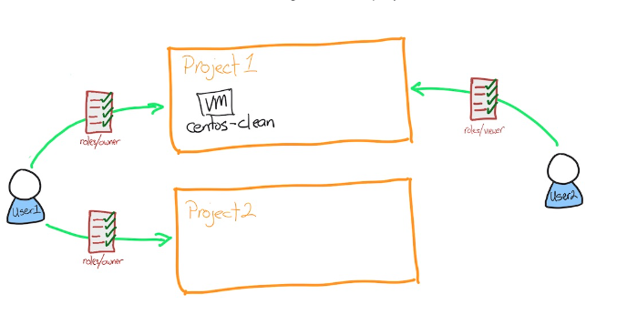
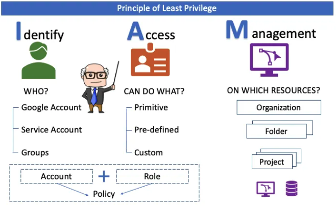
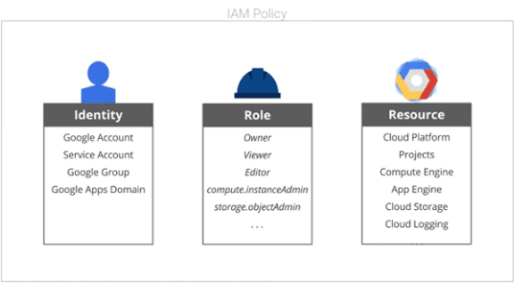
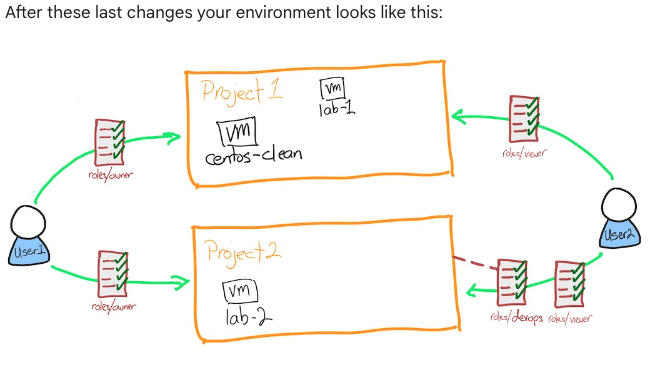
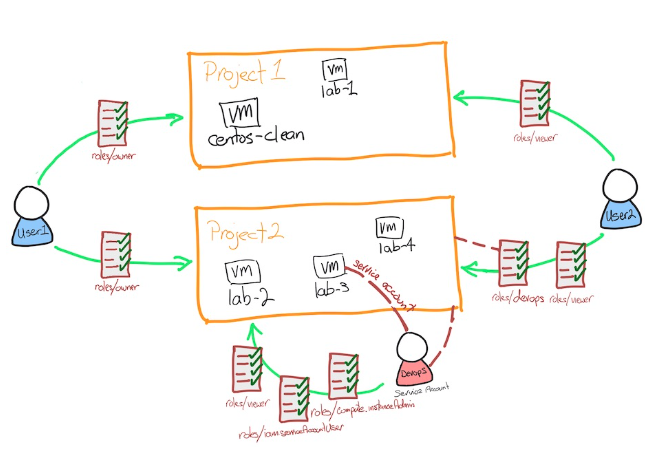

# Overview
This lab looks at three common areas to understand with regards to IAM and gcloud:

- the configuration of the gcloud environment
- the use of multiple gcloud configurations
- the use of services accounts

In this lab you use the gcloud CLI tool to set up and configure command features of Cloud Identity 
and Access Management (IAM).

What you'll learn
In this lab, you do the following:

- Review IAM and using the gcloud client
- Create and switch between multiple IAM configurations
- Identify and assign correct IAM permissions
- Create and use a service account

Starting environment
You start with two user accounts and two projects;

user1 is the "owner" of both projects
user2 is the "viewer" of only the first project.

There is a Linux virtual machine (vm) running in the first project.



---

# What is IAM?
Google Cloud offers Cloud Identity and Access Management (IAM), which lets you manage access control by 
defining who (identity) has what access (role) for which resource.

In IAM, permission to access a resource isn't granted directly to the end user. Instead, permissions are 
grouped into roles, and roles are granted to authenticated principals. (In the past, IAM often referred to 
principals as members. Some APIs still use this term.)



**Identities**\
In Cloud IAM, you grant access to principals. Principals can be of the following types:

- Google Account
- Service account
- Google group
- Google Workspace account
- Cloud Identity domain
- All authenticated users
- All users

In this lab, you use Google accounts, service accounts, and Cloud Identity domain groups.

**Roles**\
A role is a collection of permissions. You cannot assign a permission to the user directly; instead you grant 
them a role. When you grant a role to a user, you grant them all the permissions that the role contains.

**Policy**\
IAM policy is a framework that provides administrators with the ability to manage access control by defining 
who (identity) has what access (roles) to which resources within a Google Cloud project. At its core, an IAM 
policy allows you to ensure that only the right people and services have the right access to resources, and it 
does this through a set of roles and permissions.




---

Lab 

**Setup**

```
# Login
$ gcloud auth login

# Set Region & Zone
$ gcloud config set compute/region us-central1
$ gcloud config set compute/zone us-central1-a

# Note: Region > Zone

# Create a compute machine
$ gcloud compute instances create lab-1 --zone us-central1-a --machine-type=e2-standard-2

```

**Change Zone**

```

# Get the config list for the current gcloud session

$ gcloud config list

[compute]
region = us-central1
zone = us-central1-a
[core]
account = student-04-a6545d93d4b1@qwiklabs.net
disable_usage_reporting = True
project = qwiklabs-gcp-03-a3e8dc42b546

Your active configuration is: [default]


# List all available zones
$ gcloud compute zones list

# Identify one of the other zones in the same region as you. For example, if your current zone is 
# us-west2-a, you could select us-west2-b.

# Change zone
$ gcloud config set compute/zone us-central1-b


# Verify Zone is changed

$ gcloud config list

[compute]
region = us-central1
zone = us-central1-b
[core]
account = student-04-a6545d93d4b1@qwiklabs.net
disable_usage_reporting = True
project = qwiklabs-gcp-03-a3e8dc42b546

Your active configuration is: [default]

```

**Config Home**

```
The default configuration is stored in ~/.config/gcloud/configurations/config_default.

# example

$ cat ~/.config/gcloud/configurations/config_default
[core]
account = student-04-a6545d93d4b1@qwiklabs.net

[compute]
region = us-central1
zone = us-central1-b
```

**Create New IAM Config**

In this lab you have a second Google account you can log on with. This account has read-only (viewer) 
access to the first project. You create a new configuration for that user.

Note: Another user is logging into this project with different credentials, these users are stored
as configs

```
[student-04-a6545d93d4b1@centos-clean ~]$ gcloud init --no-launch-browser
Welcome! This command will take you through the configuration of gcloud.

Settings from your current configuration [default] are:
compute:
  region: us-central1
  zone: us-central1-b
core:
  account: student-04-a6545d93d4b1@qwiklabs.net
  disable_usage_reporting: 'True'
  project: qwiklabs-gcp-03-a3e8dc42b546

Pick configuration to use:
 [1] Re-initialize this configuration [default] with new settings 
 [2] Create a new configuration
Please enter your numeric choice:  2

Enter configuration name. Names start with a lower case letter and contain only lower case letters a-z, digits 0-9, and 
hyphens '-':  User2
Your current configuration has been set to: [User2]

You can skip diagnostics next time by using the following flag:
  gcloud init --skip-diagnostics

Network diagnostic detects and fixes local network connection issues.
Checking network connection...done.                                                                                    
Reachability Check passed.
Network diagnostic passed (1/1 checks passed).

```

List all configs and activate the first config (default)

```
[student-04-a6545d93d4b1@centos-clean ~]$ gcloud config configurations list
NAME      IS_ACTIVE  ACCOUNT                               PROJECT                       COMPUTE_DEFAULT_ZONE  COMPUTE_DEFAULT_REGION
config-2  False      student-04-a6545d93d4b1@qwiklabs.net  qwiklabs-gcp-03-a3e8dc42b546  us-central1-a         us-central1
default   True       student-04-a6545d93d4b1@qwiklabs.net                                us-central1-b         us-central1
user2     False      student-01-0f2cefdfc474@qwiklabs.net  qwiklabs-gcp-03-a3e8dc42b546  us-central1-a         us-central1

[student-04-a6545d93d4b1@centos-clean ~]$ gcloud config configurations activate default
Activated [default].
```

**Examine Roles and Permissions**

To view all the roles that exist in GCP

```
$ gcloud iam roles list
```

Inspect one of these roles to see the permissions assigned to the role. To view the permissions use gcloud iam roles describe.
Try looking at the simple role roles/compute.instanceAdmin.

```
$ gcloud iam roles describe roles/compute.instanceAdmin
```

**Grant access to the second user to the second project**

Activate default user

```
[student-04-a6545d93d4b1@centos-clean ~]$ gcloud config configurations activate default
Activated [default].
```

Set the second project

```
[student-04-a6545d93d4b1@centos-clean ~]$ gcloud config set project qwiklabs-gcp-04-631da58f3d4a
WARNING: You do not appear to have access to project [qwiklabs-gcp-04-631da58f3d4a] or it does not exist.
Are you sure you wish to set property [core/project] to qwiklabs-gcp-04-631da58f3d4a?

Do you want to continue (Y/n)?  Y

Updated property [core/project].
```

Assign the viewer role to the second user in the second project

```
[student-04-a6545d93d4b1@centos-clean ~]$ gcloud projects add-iam-policy-binding qwiklabs-gcp-04-631da58f3d4a --member user:student-01-0f2cefdfc474@qwiklabs.net --role=roles/viewer

Updated IAM policy for project [qwiklabs-gcp-04-631da58f3d4a].
bindings:
- members:
  - serviceAccount:qwiklabs-gcp-04-631da58f3d4a@qwiklabs-gcp-04-631da58f3d4a.iam.gserviceaccount.com
  role: roles/bigquery.admin
- members:
  - serviceAccount:603910419169@cloudbuild.gserviceaccount.com
  role: roles/cloudbuild.builds.builder
- members:
  - serviceAccount:service-603910419169@gcp-sa-cloudbuild.iam.gserviceaccount.com
  role: roles/cloudbuild.serviceAgent
- members:
  - serviceAccount:service-603910419169@compute-system.iam.gserviceaccount.com
  role: roles/compute.serviceAgent
- members:
  - serviceAccount:service-603910419169@container-engine-robot.iam.gserviceaccount.com
  role: roles/container.serviceAgent
- members:
  - serviceAccount:603910419169-compute@developer.gserviceaccount.com
  - serviceAccount:603910419169@cloudservices.gserviceaccount.com
  role: roles/editor
- members:
  - user:student-04-a6545d93d4b1@qwiklabs.net
  role: roles/iam.serviceAccountAdmin
- members:
  - serviceAccount:admiral@qwiklabs-services-prod.iam.gserviceaccount.com
  - serviceAccount:qwiklabs-gcp-04-631da58f3d4a@qwiklabs-gcp-04-631da58f3d4a.iam.gserviceaccount.com
  - user:student-04-a6545d93d4b1@qwiklabs.net
  role: roles/owner
- members:
  - user:student-04-a6545d93d4b1@qwiklabs.net
  role: roles/resourcemanager.projectIamAdmin
- members:
  - serviceAccount:qwiklabs-gcp-04-631da58f3d4a@qwiklabs-gcp-04-631da58f3d4a.iam.gserviceaccount.com
  role: roles/storage.admin
- members:
  - user:student-01-0f2cefdfc474@qwiklabs.net
  - user:student-04-a6545d93d4b1@qwiklabs.net
  role: roles/viewer
etag: BwYT4H7-S5M=
version: 1
```

**Test that user2 has access**


Activate second user

```
[student-04-a6545d93d4b1@centos-clean ~]$ gcloud config configurations activate user2
Activated [user2].
```

Set Project 2

```
[student-04-a6545d93d4b1@centos-clean ~]$ gcloud config set project qwiklabs-gcp-04-631da58f3d4a
Updated property [core/project].
```

Create an VM and see it fail (due to viewer access to project)

```
[student-04-a6545d93d4b1@centos-clean ~]$ gcloud compute instances create lab-2 --machine-type=e2-standard-2
ERROR: (gcloud.compute.instances.create) Could not fetch resource:
 - Required 'compute.instances.create' permission for 'projects/qwiklabs-gcp-04-631da58f3d4a/zones/us-central1-a/instances/lab-2'
```

Switch to Config 1 (default) to assign perms to user2

```
[student-04-a6545d93d4b1@centos-clean ~]$ gcloud config configurations activate default
Activated [default].
```

Create a Role called `devops` in project 2 and assign a bunch of permissions to it

```
[student-04-a6545d93d4b1@centos-clean ~]$ gcloud iam roles create devops --project qwiklabs-gcp-04-631da58f3d4a --permissions "compute.instances.create,compute.instances.delete,compute.instances.start,compute.instances.stop,compute.instances.update,compute.disks.create,compute.subnetworks.use,compute.subnetworks.useExternalIp,compute.instances.setMetadata,compute.instances.setServiceAccount"
Created role [devops].
etag: BwYT4JVFvqQ=
includedPermissions:
- compute.disks.create
- compute.instances.create
- compute.instances.delete
- compute.instances.setMetadata
- compute.instances.setServiceAccount
- compute.instances.start
- compute.instances.stop
- compute.instances.update
- compute.subnetworks.use
- compute.subnetworks.useExternalIp
name: projects/qwiklabs-gcp-04-631da58f3d4a/roles/devops
stage: ALPHA
title: devops
```

Assign/Bind that role to user2, this will grant all the perms from that role to user2

```
[student-04-a6545d93d4b1@centos-clean ~]$ gcloud projects add-iam-policy-binding qwiklabs-gcp-04-631da58f3d4a --member user:student-01-0f2cefdfc474@qwiklabs.net --role=projects/qwiklabs-gcp-04-631da58f3d4a/roles/devops
Updated IAM policy for project [qwiklabs-gcp-04-631da58f3d4a].
bindings:
- members:
  - user:student-01-0f2cefdfc474@qwiklabs.net
  role: projects/qwiklabs-gcp-04-631da58f3d4a/roles/devops
- members:
  - serviceAccount:qwiklabs-gcp-04-631da58f3d4a@qwiklabs-gcp-04-631da58f3d4a.iam.gserviceaccount.com
  role: roles/bigquery.admin
- members:
  - serviceAccount:603910419169@cloudbuild.gserviceaccount.com
  role: roles/cloudbuild.builds.builder
- members:
  - serviceAccount:service-603910419169@gcp-sa-cloudbuild.iam.gserviceaccount.com
  role: roles/cloudbuild.serviceAgent
- members:
  - serviceAccount:service-603910419169@compute-system.iam.gserviceaccount.com
  role: roles/compute.serviceAgent
- members:
  - serviceAccount:service-603910419169@container-engine-robot.iam.gserviceaccount.com
  role: roles/container.serviceAgent
- members:
  - serviceAccount:603910419169-compute@developer.gserviceaccount.com
  - serviceAccount:603910419169@cloudservices.gserviceaccount.com
  role: roles/editor
- members:
  - user:student-04-a6545d93d4b1@qwiklabs.net
  role: roles/iam.serviceAccountAdmin
- members:
  - user:student-01-0f2cefdfc474@qwiklabs.net
  role: roles/iam.serviceAccountUser
- members:
  - serviceAccount:admiral@qwiklabs-services-prod.iam.gserviceaccount.com
  - serviceAccount:qwiklabs-gcp-04-631da58f3d4a@qwiklabs-gcp-04-631da58f3d4a.iam.gserviceaccount.com
  - user:student-04-a6545d93d4b1@qwiklabs.net
  role: roles/owner
- members:
  - user:student-04-a6545d93d4b1@qwiklabs.net
  role: roles/resourcemanager.projectIamAdmin
- members:
  - serviceAccount:qwiklabs-gcp-04-631da58f3d4a@qwiklabs-gcp-04-631da58f3d4a.iam.gserviceaccount.com
  role: roles/storage.admin
- members:
  - user:student-01-0f2cefdfc474@qwiklabs.net
  - user:student-04-a6545d93d4b1@qwiklabs.net
  role: roles/viewer
etag: BwYT4KxUpGM=
version: 1
```

**Test the newly assigned permissions**

Activate user2 config

```
[student-04-a6545d93d4b1@centos-clean ~]$ gcloud config configurations activate user2
Activated [user2].
```

Create a VM 

```
[student-04-a6545d93d4b1@centos-clean ~]$ gcloud compute instances create lab-2 --machine-type=e2-standard-2
Created [https://www.googleapis.com/compute/v1/projects/qwiklabs-gcp-04-631da58f3d4a/zones/us-central1-a/instances/lab-2].
NAME   ZONE           MACHINE_TYPE   PREEMPTIBLE  INTERNAL_IP  EXTERNAL_IP   STATUS
lab-2  us-central1-a  e2-standard-2               10.128.0.2   34.69.52.168  RUNNING
```




**Service Accounts**

Create a service account in second project
```
[student-04-a6545d93d4b1@centos-clean ~]$ gcloud config set project qwiklabs-gcp-04-631da58f3d4a
Updated property [core/project].

[student-04-a6545d93d4b1@centos-clean ~]$ gcloud iam service-accounts create devops --display-name devops
Created service account [devops].

[student-04-a6545d93d4b1@centos-clean ~]$ gcloud iam service-accounts list  --filter "displayName=devops"
DISPLAY NAME  EMAIL                                                        DISABLED
devops        devops@qwiklabs-gcp-04-631da58f3d4a.iam.gserviceaccount.com  False
```

Fetch SA email and store it as an ENV var
```
[student-04-a6545d93d4b1@centos-clean ~]$ SA=$(gcloud iam service-accounts list --format="value(email)" --filter "displayName=devops")

```

Add Policy bingins to the SA, the role is `iam.serviceAccountUser`. This role allows the `service account` to assign a `service account` to 
a compute instance.
```
[student-04-a6545d93d4b1@centos-clean ~]$ gcloud projects add-iam-policy-binding qwiklabs-gcp-04-631da58f3d4a --member serviceAccount:$SA --role=roles/iam.serviceAccountUser
Updated IAM policy for project [qwiklabs-gcp-04-631da58f3d4a].
bindings:
- members:
  - user:student-01-0f2cefdfc474@qwiklabs.net
  role: projects/qwiklabs-gcp-04-631da58f3d4a/roles/devops
- members:
  - serviceAccount:qwiklabs-gcp-04-631da58f3d4a@qwiklabs-gcp-04-631da58f3d4a.iam.gserviceaccount.com
  role: roles/bigquery.admin
- members:
  - serviceAccount:603910419169@cloudbuild.gserviceaccount.com
  role: roles/cloudbuild.builds.builder
- members:
  - serviceAccount:service-603910419169@gcp-sa-cloudbuild.iam.gserviceaccount.com
  role: roles/cloudbuild.serviceAgent
- members:
  - serviceAccount:service-603910419169@compute-system.iam.gserviceaccount.com
  role: roles/compute.serviceAgent
- members:
  - serviceAccount:service-603910419169@container-engine-robot.iam.gserviceaccount.com
  role: roles/container.serviceAgent
- members:
  - serviceAccount:603910419169-compute@developer.gserviceaccount.com
  - serviceAccount:603910419169@cloudservices.gserviceaccount.com
  role: roles/editor
- members:
  - user:student-04-a6545d93d4b1@qwiklabs.net
  role: roles/iam.serviceAccountAdmin
- members:
  - serviceAccount:devops@qwiklabs-gcp-04-631da58f3d4a.iam.gserviceaccount.com
  - user:student-01-0f2cefdfc474@qwiklabs.net
  role: roles/iam.serviceAccountUser
- members:
  - serviceAccount:admiral@qwiklabs-services-prod.iam.gserviceaccount.com
  - serviceAccount:qwiklabs-gcp-04-631da58f3d4a@qwiklabs-gcp-04-631da58f3d4a.iam.gserviceaccount.com
  - user:student-04-a6545d93d4b1@qwiklabs.net
  role: roles/owner
- members:
  - user:student-04-a6545d93d4b1@qwiklabs.net
  role: roles/resourcemanager.projectIamAdmin
- members:
  - serviceAccount:qwiklabs-gcp-04-631da58f3d4a@qwiklabs-gcp-04-631da58f3d4a.iam.gserviceaccount.com
  role: roles/storage.admin
- members:
  - user:student-01-0f2cefdfc474@qwiklabs.net
  - user:student-04-a6545d93d4b1@qwiklabs.net
  role: roles/viewer
etag: BwYT4Lzk2WI=
version: 1
```

Add Policy bingins to the SA, the role is `compute.instanceAdmin`. This role allows the service account to manage compute instances.

.
```
[student-04-a6545d93d4b1@centos-clean ~]$ gcloud projects add-iam-policy-binding qwiklabs-gcp-04-631da58f3d4a --member serviceAccount:$SA --role=roles/compute.instanceAdmin

Updated IAM policy for project [qwiklabs-gcp-04-631da58f3d4a].
bindings:
- members:
  - user:student-01-0f2cefdfc474@qwiklabs.net
  role: projects/qwiklabs-gcp-04-631da58f3d4a/roles/devops
- members:
  - serviceAccount:qwiklabs-gcp-04-631da58f3d4a@qwiklabs-gcp-04-631da58f3d4a.iam.gserviceaccount.com
  role: roles/bigquery.admin
- members:
  - serviceAccount:603910419169@cloudbuild.gserviceaccount.com
  role: roles/cloudbuild.builds.builder
- members:
  - serviceAccount:service-603910419169@gcp-sa-cloudbuild.iam.gserviceaccount.com
  role: roles/cloudbuild.serviceAgent
- members:
  - serviceAccount:devops@qwiklabs-gcp-04-631da58f3d4a.iam.gserviceaccount.com
  role: roles/compute.instanceAdmin
- members:
  - serviceAccount:service-603910419169@compute-system.iam.gserviceaccount.com
  role: roles/compute.serviceAgent
- members:
  - serviceAccount:service-603910419169@container-engine-robot.iam.gserviceaccount.com
  role: roles/container.serviceAgent
- members:
  - serviceAccount:603910419169-compute@developer.gserviceaccount.com
  - serviceAccount:603910419169@cloudservices.gserviceaccount.com
  role: roles/editor
- members:
  - user:student-04-a6545d93d4b1@qwiklabs.net
  role: roles/iam.serviceAccountAdmin
- members:
  - serviceAccount:devops@qwiklabs-gcp-04-631da58f3d4a.iam.gserviceaccount.com
  - user:student-01-0f2cefdfc474@qwiklabs.net
  role: roles/iam.serviceAccountUser
- members:
  - serviceAccount:admiral@qwiklabs-services-prod.iam.gserviceaccount.com
  - serviceAccount:qwiklabs-gcp-04-631da58f3d4a@qwiklabs-gcp-04-631da58f3d4a.iam.gserviceaccount.com
  - user:student-04-a6545d93d4b1@qwiklabs.net
  role: roles/owner
- members:
  - user:student-04-a6545d93d4b1@qwiklabs.net
  role: roles/resourcemanager.projectIamAdmin
- members:
  - serviceAccount:qwiklabs-gcp-04-631da58f3d4a@qwiklabs-gcp-04-631da58f3d4a.iam.gserviceaccount.com
  role: roles/storage.admin
- members:
  - user:student-01-0f2cefdfc474@qwiklabs.net
  - user:student-04-a6545d93d4b1@qwiklabs.net
  role: roles/viewer
etag: BwYT4MUkJDA=
version: 1
```

Create an instance with the devops service account attached.
```
[student-04-a6545d93d4b1@centos-clean ~]$ gcloud compute instances create lab-3 --machine-type=e2-standard-2 --service-account $SA --scopes "https://www.googleapis.com/auth/compute"
Created [https://www.googleapis.com/compute/v1/projects/qwiklabs-gcp-04-631da58f3d4a/zones/us-central1-b/instances/lab-3].
NAME   ZONE           MACHINE_TYPE   PREEMPTIBLE  INTERNAL_IP  EXTERNAL_IP   STATUS
lab-3  us-central1-b  e2-standard-2               10.128.0.3   34.72.222.92  RUNNING
```

**Final environment now looks like this**



