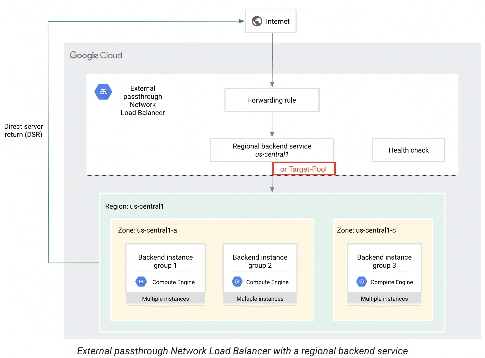
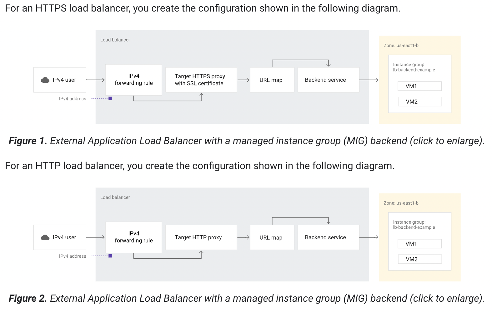

# Overview

In this hands-on lab you learn the differences between a network load balancer and an HTTP load balancer, and how to set them up for your applications running on Compute Engine virtual machines (VMs).

There are several ways you can load balance on Google Cloud. This lab takes you through the set up of the following load balancers:

- Network Load Balancer
- HTTP(s) Load Balancer

## What you'll learn
- Set up a network load balancer.
- Set up an HTTP load balancer.
- Get hands-on experience learning the differences between network load balancers and HTTP load balancers.

## Create multiple web server instances

For this load balancing scenario, create three Compute Engine VM instances and install Apache on them, then add a firewall rule that allows HTTP traffic to reach the instances.

- The code provided sets the zone to Zone. 
- Setting the tags field lets you reference these instances all at once, such as with a firewall rule. 
- These commands also install Apache on each instance and give each instance a unique home page.

1. Create a virtual machine www1 in your default zone using the following code

    ```
    gcloud compute instances create www1 \
        --zone=Zone \
        --tags=network-lb-tag \
        --machine-type=e2-small \
        --image-family=debian-11 \
        --image-project=debian-cloud \
        --metadata=startup-script='#!/bin/bash
        apt-get update
        apt-get install apache2 -y
        service apache2 restart
        echo "
    <h3>Web Server: www1</h3>" | tee /var/www/html/index.html'
    ```

2. Create a virtual machine www2 in your default zone using the following code:

    ```
    gcloud compute instances create www2 \
        --zone=Zone \
        --tags=network-lb-tag \
        --machine-type=e2-small \
        --image-family=debian-11 \
        --image-project=debian-cloud \
        --metadata=startup-script='#!/bin/bash
        apt-get update
        apt-get install apache2 -y
        service apache2 restart
        echo "
    <h3>Web Server: www2</h3>" | tee /var/www/html/index.html'
    ```

3. Create a virtual machine www3 in your default zone.

    ```
    gcloud compute instances create www3 \
        --zone=Zone  \
        --tags=network-lb-tag \
        --machine-type=e2-small \
        --image-family=debian-11 \
        --image-project=debian-cloud \
        --metadata=startup-script='#!/bin/bash
        apt-get update
        apt-get install apache2 -y
        service apache2 restart
        echo "
    <h3>Web Server: www3</h3>" | tee /var/www/html/index.html'
    ```

4. Create a firewall rule to allow external traffic to the VM instances (using the tags):

    ```
    gcloud compute firewall-rules create www-firewall-network-lb \
        --target-tags network-lb-tag --allow tcp:80
    ```

## Create a L4 Network LoadBalancer




1. Create a static external IP address for your load balancer:
    ```
    gcloud compute addresses create network-lb-ip-1 \
    --region Region
    ```

2. Add a legacy HTTP health check resource:
    ```
    gcloud compute http-health-checks create basic-check
    ```

3. Add a target pool in the same region as your instances. Run the following to create the target pool and use the health check, which is required for the service to function:

    A target pool is a group of backend instances that receive incoming traffic from external passthrough Network Load Balancers. All backend instances of a target pool must reside in the same Google Cloud region. External passthrough Network Load Balancers can use either a backend service or a target pool to define the group of backend instances.

    ```
    gcloud compute target-pools create www-pool \
    --region Region --http-health-check basic-check
    ```

4. Add the instances to the pool:
    ```
    gcloud compute target-pools add-instances www-pool \
        --instances www1,www2,www3
    ```

5. Add a forwarding rule:

    A forwarding rule specifies how to route network traffic to the backend services of a load balancer. A forwarding rule includes an IP address, an IP protocol, and one or more ports on which the load balancer accepts traffic.
    ```
    gcloud compute forwarding-rules create www-rule \
        --region  Region \
        --ports 80 \
        --address network-lb-ip-1 \
        --target-pool www-pool
    ```

    **Note: GCP automatically creates the necessary L4 load balancing infrastructure when you create the forwarding rule and specify the target pool. However, the target pool itself must be created beforehand.**

## Sending traffic to your instances

1. Access the external IP address of the LoadBalancer
    ```
    IPADDRESS=$(gcloud compute forwarding-rules describe www-rule --region Region --format="json" | jq -r .IPAddress)
    ```

2. Use curl command to access the external IP address, replacing IP_ADDRESS with an external IP address from the previous command:
    ```
    while true; do curl -m1 $IPADDRESS; done
    ```

## Create a L7 HTTP Load Balancer



HTTP(S) Load Balancing is implemented on Google Front End (GFE). GFEs are distributed globally and operate together using Google's global network and control plane. You can configure URL rules to route some URLs to one set of instances and route other URLs to other instances.

Requests are always routed to the instance group that is closest to the user, if that group has enough capacity and is appropriate for the request. If the closest group does not have enough capacity, the request is sent to the closest group that does have capacity.

To set up a load balancer with a Compute Engine backend, your VMs need to be in an instance group. The managed instance group provides VMs running the backend servers of an external HTTP load balancer. For this lab, backends serve their own hostnames.

1. First, create the instance template:
    ```
    gcloud compute instance-templates create lb-backend-template \
    --region=Region \
    --network=default \
    --subnet=default \
    --tags=allow-health-check \
    --machine-type=e2-medium \
    --image-family=debian-11 \
    --image-project=debian-cloud \
    --metadata=startup-script='#!/bin/bash
        apt-get update
        apt-get install apache2 -y
        a2ensite default-ssl
        a2enmod ssl
        vm_hostname="$(curl -H "Metadata-Flavor:Google" \
        http://169.254.169.254/computeMetadata/v1/instance/name)"
        echo "Page served from: $vm_hostname" | \
        tee /var/www/html/index.html
        systemctl restart apache2'
    ```

2. Create a managed instance group based on the template:

    Managed instance groups (MIGs) let you operate apps on multiple identical VMs. You can make your workloads scalable and highly available by taking advantage of automated MIG services, including: autoscaling, autohealing, regional (multiple zone) deployment, and automatic updating.

    ```
    gcloud compute instance-groups managed create lb-backend-group \
    --template=lb-backend-template --size=2 --zone=Zone
    ```

3. Create the fw-allow-health-check firewall rule.

    ```
    gcloud compute firewall-rules create fw-allow-health-check \
    --network=default \
    --action=allow \
    --direction=ingress \
    --source-ranges=130.211.0.0/22,35.191.0.0/16 \
    --target-tags=allow-health-check \
    --rules=tcp:80
    ```

    **Note: The ingress rule allows traffic from the Google Cloud health checking systems (130.211.0.0/22 and 35.191.0.0/16). This lab uses the target tag allow-health-check to identify the VMs**

4. Now that the instances are up and running, set up a global static external IP address that your customers use to reach your load balancer:

    ```
    gcloud compute addresses create lb-ipv4-1 \
    --ip-version=IPV4 \
    --global
    ```
    **Note the IPv4 address that was reserved:**
    ```
    gcloud compute addresses describe lb-ipv4-1 \
    --format="get(address)" \
    --global
    ```

5. Create a health check for the load balancer:

    ```
    gcloud compute health-checks create http http-basic-check \
    --port 80
    ```

6. Create a backend service:

    ```
    gcloud compute backend-services create web-backend-service \
    --protocol=HTTP \
    --port-name=http \
    --health-checks=http-basic-check \
    --global
    ```

7. Add your instance group as the backend to the backend service:

    ```
    gcloud compute backend-services add-backend web-backend-service \
    --instance-group=lb-backend-group \
    --instance-group-zone=Zone \
    --global
    ```

8. Create a URL map to route the incoming requests to the default backend service:

    ```
    gcloud compute url-maps create web-map-http \
    --default-service web-backend-service
    ```
    
    **Note: URL map is a Google Cloud configuration resource used to route requests to backend services or backend buckets. For example, with an external HTTP(S) load balancer, you can use a single URL map to route requests to different destinations based on the rules configured in the URL map:**
    - Requests for https://example.com/video go to one backend service.
    - Requests for https://example.com/audio go to a different backend service.
    - Requests for https://example.com/images go to a Cloud Storage backend bucket.
    - Requests for any other host and path combination go to a default backend service.
    
9. Create a target HTTP proxy to route requests to your URL map:

    ```
    gcloud compute target-http-proxies create http-lb-proxy \
    --url-map web-map-http
    ```

10. Create a global forwarding rule to route incoming requests to the proxy:

    ```
    gcloud compute forwarding-rules create http-content-rule \
    --address=lb-ipv4-1\
    --global \
    --target-http-proxy=http-lb-proxy \
    --ports=80
    ```