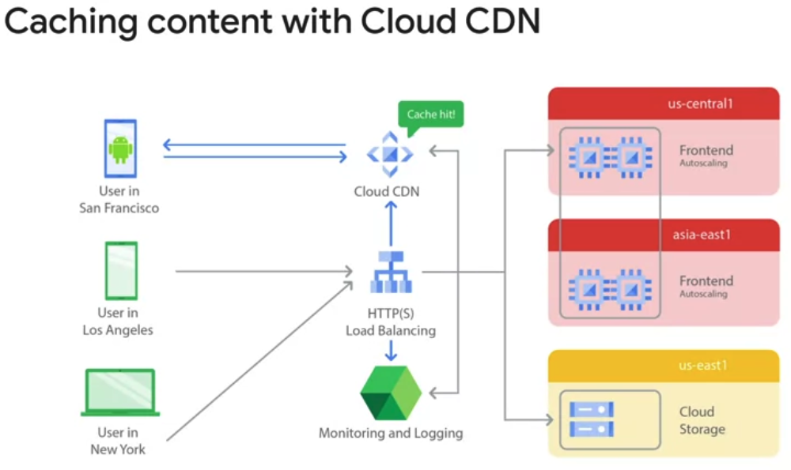

# Overview

Google Cloud CDN leverages Google's global network to cache your static and dynamic content closer to your users. This results in:

- Faster website and application load times: Reduced latency due to content being served from nearby edge locations.
- Improved user experience: Snappier interactions and smoother browsing for visitors.
- Reduced origin load: Offloads traffic from your origin servers, allowing them to handle more requests.
- Global reach: Efficiently delivers content to users around the world.

## Prerequisites:

- A Google Cloud Platform project.
- A backend service (e.g., Compute Engine instance, GKE cluster, Cloud Storage bucket) acting as your content origin.
- Your content should be publicly accessible (either directly or through a load balancer).
- Enable Cloud CDN:

## Cache Modes

The available cache modes are 
- USE_ORIGIN_HEADERS
- CACHE_ALL_STATIC 
- FORCE_CACHE_ALL. 

USE_ORIGIN_HEADERS mode requires origin responses to set valid cache directives and valid caching headers. CACHE_ALL_STATIC mode automatically caches static content that doesn't have the no-store, private, or no-cache directive.