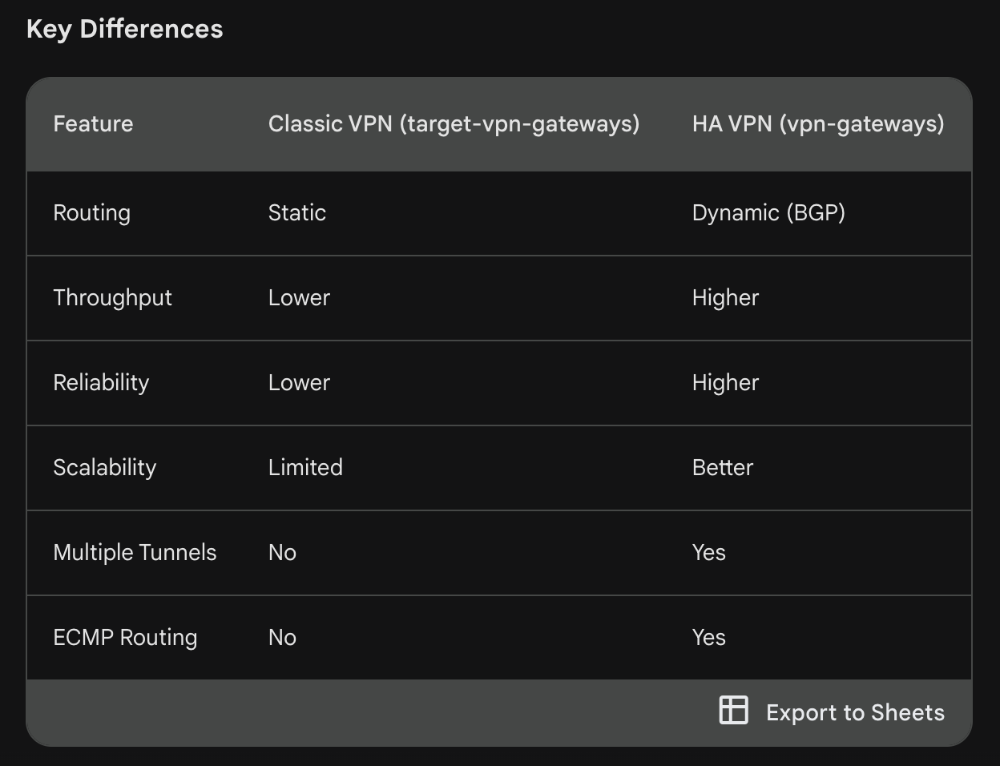

# Overview

This hands-on lab will show you how to create secure, high-throughput VPN and test the speed.

Secure communication between Google Cloud and other clouds or on-premises systems is a common, critical need. Fortunately, Google Cloud makes it easy for you to create a secure Internet Protocol security (IPsec) virtual private networks (VPNs) to achieve this goal. If a single tunnel does not provide necessary throughput, Google Cloud can smoothly distribute traffic across multiple tunnels to provide additional bandwidth.

## Classic vs New (HA) VPNs

In Google Cloud Platform (GCP), both gcloud compute target-vpn-gateways and gcloud compute vpn-gateways are related to setting up Virtual Private Networks (VPNs) to connect your on-premises network or another cloud environment securely to your Google Cloud Virtual Private Cloud (VPC) network. However, there's a crucial distinction:

### Classic VPN:

- Refers to the older generation of Cloud VPN, often called "Classic VPN."
- Uses static routing to establish VPN tunnels.
- Offers basic features and limited scalability compared to the newer option.

### Newer generation of Cloud VPN, known as "High Availability VPN" (HA VPN).
- Employs dynamic routing protocols like Border Gateway Protocol (BGP) for more robust and flexible routing.
- Provides higher throughput, improved reliability, and better scalability for larger deployments.
- Supports additional features like multiple tunnels and equal-cost multipath (ECMP) routing.



## Objectives for Classic VPN

### Create VPN
- Create a Virtual Private Cloud (VPC) named cloud to simulate your Google Cloud network, and a VPC named on-prem (on-premises) to simulate an external network.
- Create VPN gateways, forwarding rules, and addresses for the cloud VPC.
- Form a tunnel for the new VPN, and route traffic through it.
- Repeat the VPN creation process for the on-prem VPC, creating a second VPN.
### Test VPNs
- Create a virtual machine (VM) using Compute Engine for throughput load testing.
- Test throughput speed of a single VPN using iperf.

## Creating the cloud VPC

```
gcloud compute networks create cloud --subnet-mode custom

gcloud compute firewall-rules create cloud-fw --network cloud --allow tcp:22,tcp:5001,udp:5001,icmp

gcloud compute networks subnets create cloud-east --network cloud \
    --range 10.0.1.0/24 --region REGION2
```

## Creating the on-prem VPC (Simulate on-prem in GCP)

```
gcloud compute networks create on-prem --subnet-mode custom

gcloud compute firewall-rules create on-prem-fw --network on-prem --allow tcp:22,tcp:5001,udp:5001,icmp

gcloud compute networks subnets create on-prem-central \
    --network on-prem --range 192.168.1.0/24 --region REGION
```

## Creating VPN gateways

Each environment requires VPN gateways for secure external communication.

Create a VPN gateway named on-prem-gw1 in the on-prem VPC and REGION region:
gcloud
```
gcloud compute target-vpn-gateways create on-prem-gw1 --network on-prem --region REGION
```

Create a VPN gateway named cloud-gw1 in the cloud VPC and REGION2 region:

```
gcloud compute target-vpn-gateways create cloud-gw1 --network cloud --region REGION2
```

## Creating a route-based VPN tunnel between local and Google Cloud networks

The VPN gateways each need a static, external IP address so that systems outside the VPC can communicate with them. Now you'll create IP addresses and routes on the cloud and on-prem VPCs.


Allocate the IP for the cloud-gw1 VPN gateway

```
gcloud compute addresses create cloud-gw1 --region REGION2

cloud_gw1_ip=$(gcloud compute addresses describe cloud-gw1 \
    --region REGION2 --format='value(address)')
```

Allocate the IP for the on-prem-gw1 VPN gateway

```
gcloud compute addresses create on-prem-gw1 --region REGION

on_prem_gw_ip=$(gcloud compute addresses describe on-prem-gw1 \
    --region REGION --format='value(address)')
```

Create forwarding rules for IPsec on the cloud VPC. You'll need to create forwarding rules in both directions. This is for Cloud VPC gateway cloud-gw1

```
# Forward the Encapsulating Security Payload (ESP) protocol from cloud-gw1:

gcloud compute forwarding-rules create cloud-1-fr-esp --ip-protocol ESP \
    --address $cloud_gw1_ip --target-vpn-gateway cloud-gw1 --region REGION2


# Forward UDP:500 traffic from cloud-gw1:

gcloud compute forwarding-rules create cloud-1-fr-udp500 --ip-protocol UDP \
    --ports 500 --address $cloud_gw1_ip --target-vpn-gateway cloud-gw1 --region REGION2

Forward UDP:4500 traffic from cloud-gw1:

gcloud compute forwarding-rules create cloud-fr-1-udp4500 --ip-protocol UDP \
    --ports 4500 --address $cloud_gw1_ip --target-vpn-gateway cloud-gw1 --region REGION2

```

Use the same method to create firewall forwarding rules for the IPsec tunnel on the on-prem VPC. This step allows the IPsec tunnel to exit your firewalls

```
# Forward the ESP protocol from on-prem-gw1:

gcloud compute forwarding-rules create on-prem-fr-esp --ip-protocol ESP \
    --address $on_prem_gw_ip --target-vpn-gateway on-prem-gw1 --region REGION

# Forward UDP:500 traffic, used in establishing the IPsec tunnel from on-prem-gw1:

gcloud compute forwarding-rules create on-prem-fr-udp500 --ip-protocol UDP --ports 500 \
    --address $on_prem_gw_ip --target-vpn-gateway on-prem-gw1 --region REGION

# Forward UDP:4500 traffic, which carries the encrypted traffic from on-prem-gw1:

gcloud compute forwarding-rules create on-prem-fr-udp4500 --ip-protocol UDP --ports 4500 \
    --address $on_prem_gw_ip --target-vpn-gateway on-prem-gw1 --region REGION

```

Ordinarily you would need to go generate a secret for the next step, where you create and validate the tunnels on-prem-tunnel1 and cloud-tunnel1. For details about how to create and securely store secrets, view the Secret Manager conceptual overview guide. For now just use the string "sharedsecret".

Create a tunnel for the local network on-prem-tunnel1, and for the cloud-based network cloud-tunnel1. Each network must have a VPN gateway, and the secrets must match. In the following two commands, where you would, in a production scenario, replace [MY_SECRET] with the secret you generated


### Create the VPN tunnel from on-prem to cloud:
```
gcloud compute vpn-tunnels create on-prem-tunnel1 --peer-address $cloud_gw1_ip \
    --target-vpn-gateway on-prem-gw1 --ike-version 2 --local-traffic-selector 0.0.0.0/0 \
    --remote-traffic-selector 0.0.0.0/0 --shared-secret=[MY_SECRET] --region REGION
```

### Create the VPN tunnel from cloud to on-prem:

**Note: Its the VPN tunnel that attaches the IP to the vpn gateway**

```
gcloud compute vpn-tunnels create cloud-tunnel1 --peer-address $on_prem_gw_ip \
    --target-vpn-gateway cloud-gw1 --ike-version 2 --local-traffic-selector 0.0.0.0/0 \
    --remote-traffic-selector 0.0.0.0/0 --shared-secret=[MY_SECRET] --region REGION2
```

### Add routes from the subnets through the two tunnels.

**These rules tells gcp how the traffic should be routed to the networks**

Route traffic from the on-prem VPC to the cloud 10.0.1.0/24 range into the tunnel:
```
gcloud compute routes create on-prem-route1 --destination-range 10.0.1.0/24 \
    --network on-prem --next-hop-vpn-tunnel on-prem-tunnel1 \
    --next-hop-vpn-tunnel-region REGION
```

Route traffic from the cloud VPC to the on-prem 192.168.1.0/24 range into the tunnel:

```
gcloud compute routes create cloud-route1 --destination-range 192.168.1.0/24 \
    --network cloud --next-hop-vpn-tunnel cloud-tunnel1 --next-hop-vpn-tunnel-region REGION2
```

## Testing throughput over VPN

At this point, you've established a secure path between the on-prem and cloud VPCs. To test throughput use iperf, an open-source tool for network load testing. To test, you'll need a VM in each environment, one to send traffic and the other to receive it, and you'll create them next.

Create a virtual machine for the cloud VPC named cloud-loadtest.

```
gcloud compute instances create "cloud-loadtest" --zone ZONE2 \
    --machine-type "e2-standard-4" --subnet "cloud-east" \
    --image-family "debian-11" --image-project "debian-cloud" --boot-disk-size "10" \
    --boot-disk-type "pd-standard" --boot-disk-device-name "cloud-loadtest"
```

Create a virtual machine for the on-prem VPC named on-prem-loadtest.

```
gcloud compute instances create "on-prem-loadtest" --zone ZONE \
    --machine-type "e2-standard-4" --subnet "on-prem-central" \
    --image-family "debian-11" --image-project "debian-cloud" --boot-disk-size "10" \
    --boot-disk-type "pd-standard" --boot-disk-device-name "on-prem-loadtest"
```

SSH into each VM, using the Console or command line, and install a copy of iperf with the following command line:
```
sudo apt-get install iperf
```

On the on-prem-loadtest VM, run this command:
```
iperf -s -i 5
```

On the cloud-loadtest VM, run this command:
```
iperf -c 192.168.1.2 -P 20 -x C
```

This creates an iperf client with twenty streams, which will report values after 10 seconds of testing.
