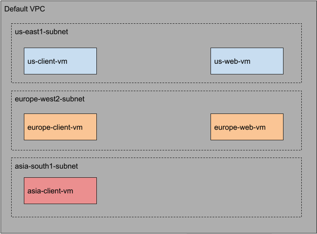
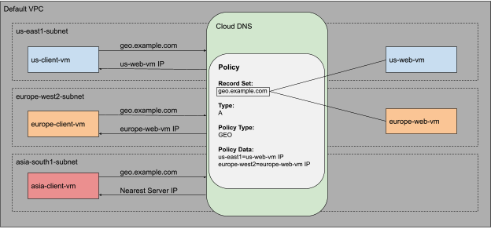

# Overview

Cloud DNS routing policies enable users to configure DNS based traffic steering.
​​In this lab you will configure and test the Geolocation routing policy. Use GEO to specify source geolocations 
and to provide DNS answers corresponding to those geographies. The geolocation routing policy applies the nearest 
match for the source location when the traffic source location doesn't match any policy items exactly.

# What you learn

You will learn how to:

1. Launch client VMs, one in each ZONE
2. Launch server VMs, one in each ZONE except asia-southeast1
3. Create a private zone, for example.com
4. Create a Geolocation routing policy using gcloud commands
5. Test the configuration

# Architecture
Use the default VPC network to create all the virtual machines (VM) and launch client VMs in 3 Google Cloud 
locations: us-west1, europe-west1 and asia-southeast1. To demonstrate the behavior of Geolocation routing policy, you will create 
the server VMs only in 2 ZONEs: us-west1 and europe-west1.




## Policy

You will use Cloud DNS routing policies and create `ResourceRecordSets` for geo.example.com and configure the Geolocation 
policy to help ensure that a client request is routed to a server in the client's closest ZONE.

Note: `ResourceRecordSets` means dns records



# Enable APIs

Enable Compute Engine API \
Run the gcloud services enable command to enable the Compute Engine API:
```
gcloud services enable compute.googleapis.com
```

Enable Cloud DNS API \
Run the gcloud services enable command to enable the Cloud DNS API:
```
gcloud services enable dns.googleapis.com
```

Verify that the APIs are enabled \
Run the gcloud services list command to list all the enabled APIs. We should see compute.googleapis.com 
and dns.googleapis.com in the listed output.
```
$ gcloud services list | grep -E 'compute|dns'
NAME: compute.googleapis.com
NAME: dns.googleapis.com
```

# Configure the firewall

1. Client
To be able to SSH into the client VMs, run the following to create a firewall rule to allow SSH traffic 
from Identity Aware Proxies (IAP):

Note: IAP provides a single point of control for managing user access to web applications and 
cloud resources. It allows work from untrusted networks without the use of a VPN. It Verifes user 
identity and use context to determine if a user should be granted access.


```
gcloud compute firewall-rules create fw-default-iapproxy \
--direction=INGRESS \
--priority=1000 \
--network=default \
--action=ALLOW \
--rules=tcp:22,icmp \
--source-ranges=35.235.240.0/20
```

2. Server
To allow HTTP traffic on the web servers, each web server will have a "http-server" tag associated with it. You 
will use this tag to apply the firewall rule only to your web servers:

```
gcloud compute firewall-rules create allow-http-traffic \
--direction=INGRESS \
--priority=1000 \
--network=default \
--action=ALLOW \
--rules=tcp:80 \
--source-ranges=0.0.0.0/0 \
--target-tags=http-server
```

# Launch client VMs

Run the gcloud compute instances create command to create the client VMs in each zone:

1. Zone 1
```
gcloud compute instances create us-client-vm --machine-type e2-medium --zone us-west1
```

2. Zone 2
```
gcloud compute instances create us-client-vm --machine-type e2-medium --zone europe-west1
```

3. Zone 3
```
gcloud compute instances create us-client-vm --machine-type e2-medium --zone asia-southeast1
```

# Launch Server VMs

Now that the client VM's are up and running, the next step is to create the server VMs. You will use a 
startup script to configure and set up the web servers. As mentioned earlier, you will create the server 
VMs only in 2 ZONEs: us-west1 and europe-west1.

1. Launch server in us-west1

```
gcloud compute instances create us-web-vm \
--zone=us-west1 \
--machine-type=e2-medium \
--network=default \
--subnet=default \
--tags=http-server \
--metadata=startup-script='#! /bin/bash
 apt-get update
 apt-get install apache2 -y
 echo "Page served from: us-west1" | \
 tee /var/www/html/index.html
 systemctl restart apache2'
 ```

 2. Launch server in europe-west1

 ```
 gcloud compute instances create europe-web-vm \
--zone=europe-west1 \
--machine-type=e2-medium \
--network=default \
--subnet=default \
--tags=http-server \
--metadata=startup-script='#! /bin/bash
 apt-get update
 apt-get install apache2 -y
 echo "Page served from: europe-west1" | \
 tee /var/www/html/index.html
 systemctl restart apache2'
 ```

# Setting up environment variables

Before you configure Cloud DNS, note the Internal IP addresses of the web servers. You need these IPs to 
create the routing policy. In this section, you will use the gcloud compute instances describe command to 
save the internal IP addresses as environment variables.

1. Command to save IP address for the vm in us-west1:

```
export US_WEB_IP=$(gcloud compute instances describe us-web-vm --zone=us-west1 --format="value(networkInterfaces.networkIP)")
```

2. Command to save the IP address for vm in europe-west1:

```
export EUROPE_WEB_IP=$(gcloud compute instances describe europe-web-vm --zone=europe-west1 --format="value(networkInterfaces.networkIP)")
```

# Create the private zone for a domain that you own (assuming example.com is a domain that you own)

Now that your client and server VMs are running, it's time to configure the DNS settings. Before creating 
the A records for the web servers, you need to create the Cloud DNS Private Zone.

For this lab, use the `example.com` domain name for the Cloud DNS zone.

Note: See[gcp cloud domains](https://cloud.google.com/domains/docs) for gcp cloud domains.

Use the gcloud dns managed-zones create command to create the zone:
```
gcloud dns managed-zones create example --description=test --dns-name=example.com --networks=default --visibility=private
```

Note: 
Managed zones are dns zone that you managed using Cloud DNS.
- Public zones are managed zones to resolve dns names from the Internet (--visibility=public).
- Private zones are managed zones to resolve dns names from VPC networks (--visibility=private).

# Create Cloud DNS Routing Policy

In this section, configure the Cloud DNS Geolocation Routing Policy. You will create a record set in the example.com 
zone that you created in the previous section.

Use the gcloud beta dns record-sets create command to create the geo.example.com recordset:
```
gcloud beta dns record-sets create geo.example.com \
--ttl=5 --type=A --zone=example \
--routing_policy_type=GEO \
--routing_policy_data="us-west1=$US_WEB_IP;europe-west1=$EUROPE_WEB_IP"
```

# Verify Cloud DNS Routing Policy

Use the dns record-sets list command to verify that the geo.example.com DNS record is configured as expected:

```
gcloud beta dns record-sets list --zone=example
```

# Testing

It's time to test the configuration. In this section, you will SSH into all the client VMs. Since all of the web 
server VMs are behind the geo.example.com domain, you will use cURL command to access this endpoint.

Since you are using a Geolocation policy, the expected result is that:

The client in the US should always get a response from the us-west1 region.
The client in Europe should always get a response from the europe-west1 region.

1. Testing from the client VM in us-west1

Use the gcloud compute ssh command to log into the client VM:
```
gcloud compute ssh us-client-vm --zone us-west1 --tunnel-through-iap
```

cURL the `curl geo.example.com` endpoint & check for custom message from the startup script above for us-west1
```
curl geo.example.com
```

2. Testing from the client VM in europe-west1

Use the gcloud compute ssh command to log into the client VM:
```
gcloud compute ssh europe-client-vm --zone europe-west1 --tunnel-through-iap
```

cURL the `curl geo.example.com` endpoint & check for custom message from the startup script above for europe-west1
```
curl geo.example.com
```

3. Testing from the client VM in asia-southeast1

So far you have tested the setup from us-west1 and europe-west1. You have servers running in both the regions and have 
matching record sets for both the regions in Cloud DNS routing policy. There is no matching policy item for asia-southeast1 
in the Cloud DNS routing policy that was created in this lab.

The Geolocation policy will apply a "nearest" match for source location when the source of the traffic doesn't match 
any policy items exactly. This means that the client in the asia-southeast1 region should be directed to the nearest web server.

In this section, you will resolve the geo.example.com domain from the client VM in Asia and will analyze the response.

SSH into the us-client-vm:
```
gcloud compute ssh asia-client-vm --zone asia-southeast1 --tunnel-through-iap
```

Then access geo.example.com:
```
curl geo.example.com
```

Analyze the output to see which server is responding to the request. Since there is no policy item for asia-southeast1, 
Cloud DNS will direct the client to the nearest server.

# Delete lab resources

Although all resources you used in this lab will be deleted when you finish, it is good practice to remove resources 
you no longer need to avoid unnecessary charges.

```
#delete VMS
gcloud compute instances delete -q us-client-vm --zone us-west1

gcloud compute instances delete -q us-web-vm --zone us-west1

gcloud compute instances delete -q europe-client-vm --zone europe-west1

gcloud compute instances delete -q europe-web-vm --zone europe-west1

gcloud compute instances delete -q asia-client-vm --zone asia-southeast1

#delete FW rules
gcloud compute firewall-rules delete -q allow-http-traffic

gcloud compute firewall-rules delete fw-default-iapproxy

#delete record set
gcloud beta dns record-sets delete geo.example.com --type=A --zone=example

#delete private zone
gcloud dns managed-zones delete example
```