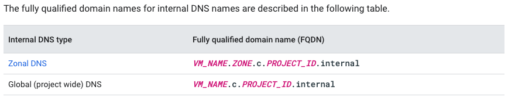
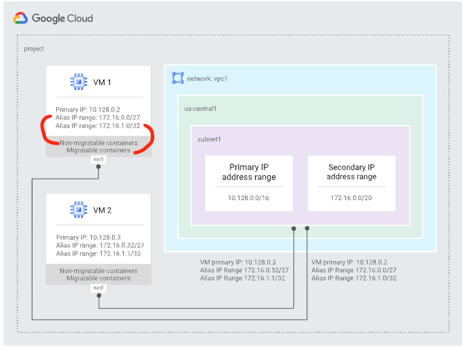

# Overview

When you create Compute Engine virtual machine (VM) instances, internal DNS automatically creates a DNS name for the VM. This DNS name facilitates internal VM-to-VM communication by resolving internal IP addresses. Virtual Private Cloud networks on Google Cloud use the internal DNS service to let VMs in the same network access each other by using internal DNS names.

Google Cloud automatically creates, updates, and removes the following DNS records types as you manage your VMs:

DNS address records, or A records, are created for VMs in a DNS zone for .internal.
PTR records for VMs, used for reverse DNS lookup, are created in corresponding reverse zones.
For example, when you delete a VM, Google Cloud automatically removes the associated A and PTR records for its internal DNS name. If you then create a VM with the same name, Google Cloud creates a new record for the replacement.

## Zonal and global internal DNS names

Google Cloud has two types of internal DNS names:

Zonal DNS: VM names must be unique within each zone, but you can reuse VM names across zones. For example, you can have several VMs named instance-1 as long as the VMs are in different zones.
Global DNS: VM names must be unique within each project. With global DNS, you can't reuse VM names within the project.

## Internal DNS FQDN

An internal fully qualified domain name (FQDN) for an instance looks like this: `hostName.[ZONE].c.[PROJECT_ID].internal`.
You can always connect from one instance to another using this FQDN. If you want to connect to an instance using, for example, 
just hostName, you need information from the internal DNS resolver that is provided as part of Compute Engine.

The fully qualified domain names for internal DNS names are described in the following table.

## Internal IP addresses DNS name resolution

Each instance has a metadata server that also acts as a DNS resolver for that instance. DNS lookups are performed 
for instance names. The metadata server itself stores all DNS information for the local network and queries Google's 
public DNS servers for any addresses outside of the local network.

VMs receive internal DNS resolution information as part of their DHCP leases. The method of DNS resolution depends on the operating 
system platform:

- Linux: By default, the VM's DNS server (`169.254.169.254:53`) resolves internal DNS names.
- Windows: By default, the subnet's default gateway resolves internal DNS names.

Compute Engine VMs are configured to renew DHCP leases every 24 hours. For VMs that are enabled for zonal DNS, the DHCP lease expires 
every hour. VMs using zonal DNS have both zonal and global entries in the DHCP configuration file.

By default, most Linux distributions store DHCP information in `resolv.conf`. Manually editing resolv.conf results in it being reverted 
to the default DHCP every time the DHCP lease expires on your VM. To make static modifications in the resolv.conf file, several Linux 
distributions allow items to be prepended or appended to the DHCP policy.

How you modify the DHCP policy or configuration file depends on what distribution of Linux you use. For example, Red Hat Enterprise Linux 
and Debian use the `/etc/dhcp/dhcpd.conf` configuration file. On CentOS, you use the Network Manager command line utility, `nmcli`.

Refer to your operating system documentation for information about how to configure custom DHCP and DNS network settings. For example, for 
Red Hat Enterprise Linux for SAP with HA and Update Services 8.6, use the following link: Manually configuring the `/etc/resolv.conf` file

## Alias IP ranges

Google Cloud alias IP ranges let you assign ranges of internal IP addresses as aliases to a virtual machine's (VM) network interfaces. This is useful if you have multiple services running on a VM and you want to assign each service a different IP address. Alias IP ranges also work with GKE Pods.

If you have only one service running on a VM, you can reference it by using the interface's primary IP address. If you have multiple services running on a VM, you might want to assign each one a different internal IP address. You can do this with alias IP ranges.

### Subnet primary and secondary CIDR ranges
All subnets have a primary CIDR range, which is the range of internal IP addresses that define the subnet. Each VM instance gets its primary internal IP address from this range. You can also allocate alias IP (secondary) ranges from the secondary range. These secondary subnet ranges merely provide an organizational tool.

**Note: Alias IP addresses can be announced by Cloud Router to an on-premises network connected via VPN or Interconnect.**

