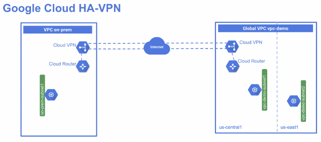

# Overview

HA VPN is a high-availability (HA) Cloud VPN solution that lets you securely connect your on-premises network to your VPC network through an IPsec VPN connection in a single region. HA VPN provides an SLA of 99.99% service availability.

HA VPN is a regional per VPC, VPN solution. HA VPN gateways have two interfaces, each with its own public IP address. When you create an HA VPN gateway, two public IP addresses are automatically chosen from different address pools. When HA VPN is configured with two tunnels, Cloud VPN offers a 99.99% service availability uptime.

In this lab you create a global VPC called vpc-demo, with two custom subnets in REGION 2 and REGION 1. In this VPC, you add a Compute Engine instance in each region. You then create a second VPC called on-prem to simulate a customer's on-premises data center. In this second VPC, you add a subnet in region REGION 1 and a Compute Engine instance running in this region. Finally, you add an HA VPN and a cloud router in each VPC and run two tunnels from each HA VPN gateway before testing the configuration to verify the 99.99% SLA.



## Objectives

- Create two VPC networks and instances.
- Configure HA VPN gateways.
- Configure dynamic routing with VPN tunnels.
- Configure global dynamic routing mode.
- Verify and test HA VPN gateway configuration.

## Understanding Regions and Zones

Certain Compute Engine resources live in regions or zones. A region is a specific geographical location where you can run 
your resources. Each region has one or more zones. For example, the us-central1 region denotes a region in the Central 
United States that has zones us-central1-a, us-central1-b, us-central1-c, and us-central1-f.

Regions	Zones
```
Western US	    us-west1-a, us-west1-b
Central US	    us-central1-a, us-central1-b, us-central1-d, us-central1-f
Eastern US	    us-east1-b, us-east1-c, us-east1-d
Western Europe	europe-west1-b, europe-west1-c, europe-west1-d
Eastern Asia	asia-east1-a, asia-east1-b, asia-east1-c
```

Resources that live in a zone are referred to as zonal resources. Virtual machine Instances and persistent disks live in a zone. 
To attach a persistent disk to a virtual machine instance, both resources must be in the same zone. Similarly, if you want to 
assign a static IP address to an instance, the instance must be in the same region as the static IP.

## Set up a Global VPC environment

Set up a Global VPC with two custom subnets and two VM instances running in each zone.

1. In Cloud Shell, create a VPC network called vpc-demo:
    ```
    gcloud compute networks create vpc-demo --subnet-mode custom
    ```

2. Create subnet vpc-demo-subnet1 in the region `REGION 1`
    ```
    gcloud compute networks subnets create vpc-demo-subnet1 \
    --network vpc-demo --range 10.1.1.0/24 --region "REGION1"
    ```

3. Create subnet vpc-demo-subnet2 in the region `REGION 2`:
    ```
    gcloud compute networks subnets create vpc-demo-subnet2 \
    --network vpc-demo --range 10.2.1.0/24 --region REGION2
    ```

4. Create a firewall rule to allow all custom traffic within the network:
    ```
    gcloud compute firewall-rules create vpc-demo-allow-custom \
    --network vpc-demo \
    --allow tcp:0-65535,udp:0-65535,icmp \
    --source-ranges 10.0.0.0/8
    ```

5. Create a firewall rule to allow SSH, ICMP traffic from anywhere:
    ```
    gcloud compute firewall-rules create vpc-demo-allow-ssh-icmp \
    --network vpc-demo \
    --allow tcp:22,icmp
    ```

6. Create a VM instance vpc-demo-instance1 in zone `ZONE 1` in `REGION 1`
    ```
    gcloud compute instances create vpc-demo-instance1 --machine-type=e2-medium --zone "ZONE1" --subnet vpc-demo-subnet1
    ```

7. Create a VM instance vpc-demo-instance2 in zone `ZONE 2` in `REGION 2`
    ```
    gcloud compute instances create vpc-demo-instance2 --machine-type=e2-medium --zone "ZONE2" --subnet vpc-demo-subnet2
    ```

## Set up a simulated on-premises environment

Create a VPC called `on-prem` that simulates an on-premises environment from where a customer connects to the Google cloud environment.

1. Create a VPC network called `on-prem`
    ```
    gcloud compute networks create on-prem --subnet-mode custom
    ```

2. Create a subnet called `on-prem-subnet1` in region `REGION 1`
    ```
    gcloud compute networks subnets create on-prem-subnet1 \
    --network on-prem --range 192.168.1.0/24 --region "REGION1"
    ```

3. Create a firewall rule to allow all custom traffic within the network
    ```
    gcloud compute firewall-rules create on-prem-allow-custom \
    --network on-prem \
    --allow tcp:0-65535,udp:0-65535,icmp \
    --source-ranges 192.168.0.0/16
    ```

4. Create a firewall rule to allow SSH, RDP, HTTP, and ICMP traffic to the instances
    ```
    gcloud compute firewall-rules create on-prem-allow-ssh-icmp \
    --network on-prem \
    --allow tcp:22,icmp
    ```

5. Create an instance called `on-prem-instance1` in the region `REGION 1`, but the `zone` should be different from the one used to create the `vpc-demo-instance1` in the `vpc-demo-subnet1`
    ```
    gcloud compute instances create on-prem-instance1 --machine-type=e2-medium --zone "ZONE3" --subnet on-prem-subnet1
    ```

## Set up HA VPN gateways

Create an HA VPN gateway in each VPC network.

1. Create an HA VPN gateway in the `vpc-demo` network in `REGION 1`
    ```
    gcloud compute vpn-gateways create vpc-demo-vpn-gw1 --network vpc-demo --region "REGION1"
    ```

2. Create an HA VPN gateway in the `on-prem` network in region `REGION 1`
    ```
    gcloud compute vpn-gateways create on-prem-vpn-gw1 --network on-prem --region "REGION1"
    ```

## Setup Cloud Routers

Create an HA VPN gateway in each VPC network.

1. Create a cloud router in the `vpc-demo` network:
    ```
    gcloud compute routers create vpc-demo-router1 \
    --region "REGION1" \
    --network vpc-demo \
    --asn 65001
    ```

2. Create a cloud router in the `on-prem` network:
    ```
    gcloud compute routers create on-prem-router1 \
    --region "REGION1" \
    --network on-prem \
    --asn 65002
    ```

## Create two VPN tunnels in each Cloud VPN gateway

Create VPN tunnels between the two gateways. For HA VPN setup, you add two tunnels from each gateway to the remote setup. 
- Create a tunnel on `interface0` and connect to `interface0` on the remote gateway. 
- Create another tunnel on `interface1` and connect to `interface1` on the remote gateway.

**Note: In an on-prem environment, if you run HA VPN to a remote VPN gateway on-premises for a customer, you can connect in one of the following ways:**
- Two on-premises VPN gateway devices: Each of the tunnels from each interface on the Cloud VPN gateway must be connected to its own peer gateway.
- A single on-premises VPN gateway device with two interfaces: Each of the tunnels from each interface on the Cloud VPN gateway must be connected to its own interface on the peer gateway.
- A single on-premises VPN gateway device with a single interface: Both of the tunnels from each interface on the Cloud VPN gateway must be connected to the same interface on the peer gateway.

In this lab you are simulating an on-premises setup with both VPN gateways in Google Cloud. You ensure that interface0 of one gateway connects to interface0 of the other and interface1 connects to interface1 of the remote gateway.

1. Create the first VPN tunnel in the `vpc-demo` network
    ```
    gcloud compute vpn-tunnels create vpc-demo-tunnel0 \
    --peer-gcp-gateway on-prem-vpn-gw1 \
    --region "REGION" \
    --ike-version 2 \
    --shared-secret [SHARED_SECRET] \
    --router vpc-demo-router1 \
    --vpn-gateway vpc-demo-vpn-gw1 \
    --interface 0
    ```

2. Create the second VPN tunnel in the `vpc-demo` network:
    ```
    gcloud compute vpn-tunnels create vpc-demo-tunnel1 \
    --peer-gcp-gateway on-prem-vpn-gw1 \
    --region "REGION" \
    --ike-version 2 \
    --shared-secret [SHARED_SECRET] \
    --router vpc-demo-router1 \
    --vpn-gateway vpc-demo-vpn-gw1 \
    --interface 1
    ```

3. Create the first VPN tunnel in the on-prem network:
    ```
    gcloud compute vpn-tunnels create on-prem-tunnel0 \
    --peer-gcp-gateway vpc-demo-vpn-gw1 \
    --region "REGION" \
    --ike-version 2 \
    --shared-secret [SHARED_SECRET] \
    --router on-prem-router1 \
    --vpn-gateway on-prem-vpn-gw1 \
    --interface 0
    ```

4. Create the second VPN tunnel in the on-prem network:
    ```
    gcloud compute vpn-tunnels create on-prem-tunnel1 \
    --peer-gcp-gateway vpc-demo-vpn-gw1 \
    --region "REGION" \
    --ike-version 2 \
    --shared-secret [SHARED_SECRET] \
    --router on-prem-router1 \
    --vpn-gateway on-prem-vpn-gw1 \
    --interface 1
    ```

## Create Border Gateway Protocol (BGP) peering for each tunnel

Configure BGP peering for each VPN tunnel between vpc-demo and VPC on-prem. HA VPN requires dynamic routing to enable 99.99% availability.

### Border Gateway Protocol Routing

When a VPN tunnel is established, BGP (Border Gateway Protocol) can be used to dynamically exchange routing information between the two ends of the tunnel. 
Here's how it works:

1. VPN Tunnel Establishment:
    - A VPN tunnel is created between two networks, establishing a secure connection.
    - Each end of the tunnel has a VPN gateway or router responsible for managing the VPN connection and routing traffic.

2. BGP Peering:
    - The VPN gateways or routers on both ends of the tunnel are configured as BGP peers.
    - BGP peering involves exchanging BGP messages to establish a neighbor relationship and share routing information.

3. BGP Route Advertisement:
    - Each VPN gateway advertises its own network prefixes (IP address ranges) and any other prefixes it has learned from other BGP peers or internal routing protocols to its BGP peer across the VPN tunnel.
    - These advertisements typically include attributes like the AS path (a list of autonomous systems the route has passed through) and local preference (a measure of how preferred the route is).

4. BGP Route Selection:
    - Each VPN gateway receives route advertisements from its peer and uses BGP's decision process to select the best path for each destination prefix.
    - BGP's decision process considers various factors, including local preference, AS path length, and other route attributes, to determine the most optimal route.

5. Routing Table Update:
    - The selected routes are added to the routing table of each VPN gateway.
    - These routes define the path that traffic should take to reach destinations on the other side of the VPN tunnel.

6. Traffic Forwarding:
    - When traffic destined for a network on the other side of the VPN tunnel arrives at a VPN gateway, the gateway consults its routing table and forwards the traffic through the VPN tunnel based on the learned BGP routes.

#### Benefits of using BGP for VPN routing

- Dynamic Routing: BGP automatically adapts to changes in network topology or reachability, ensuring that traffic is always routed along the best available path.
Scalability: BGP can handle large numbers of routes and peers, making it suitable for complex VPN environments.
Flexibility: BGP supports various route attributes and policies, allowing for fine-grained control over traffic routing.
Key Points:

- BGP is an exterior gateway protocol primarily used for routing between autonomous systems (AS) on the internet, but it's increasingly used for VPN routing.
BGP peering can be established over various VPN technologies like IPsec or MPLS.
BGP is not the only way to route traffic over VPNs; static routes or dynamic routing protocols like OSPF or EIGRP can also be used, but they may not be as scalable or flexible as BGP.

## Create Border Gateway Protocol (BGP) peering for each tunnel

Configure BGP peering for each VPN tunnel between `vpc-demo` and VPC `on-prem`. HA VPN requires dynamic routing to enable 99.99% availability.

1. Create the router interface for tunnel0 in network `vpc-demo`:
    ```
    gcloud compute routers add-interface vpc-demo-router1 \
    --interface-name if-tunnel0-to-on-prem \
    --ip-address 169.254.0.1 \
    --mask-length 30 \
    --vpn-tunnel vpc-demo-tunnel0 \
    --region "REGION1"
    ```

2. Create the BGP peer for tunnel0 in network `vpc-demo` (peer to route interface for `tunnel0` in network `on-prem`):
    ```
    gcloud compute routers add-bgp-peer vpc-demo-router1 \
    --peer-name bgp-on-prem-tunnel0 \
    --interface if-tunnel0-to-on-prem \
    --peer-ip-address 169.254.0.2 \
    --peer-asn 65002 \
    --region "REGION1"
    ```

3. Create a router interface for tunnel1 in network `vpc-demo`:
    ```
    gcloud compute routers add-interface vpc-demo-router1 \
    --interface-name if-tunnel1-to-on-prem \
    --ip-address 169.254.1.1 \
    --mask-length 30 \
    --vpn-tunnel vpc-demo-tunnel1 \
    --region "REGION1"
    ```

4. Create the BGP peer for tunnel1 in network `vpc-demo` (peer to route interface for `tunnel1` in network `on-prem`):
    ```
    gcloud compute routers add-bgp-peer vpc-demo-router1 \
    --peer-name bgp-on-prem-tunnel1 \
    --interface if-tunnel1-to-on-prem \
    --peer-ip-address 169.254.1.2 \
    --peer-asn 65002 \
    --region "REGION1"
    ```

5. Create a router interface for tunnel0 in network `on-prem`:
    ```
    gcloud compute routers add-interface on-prem-router1 \
    --interface-name if-tunnel0-to-vpc-demo \
    --ip-address 169.254.0.2 \
    --mask-length 30 \
    --vpn-tunnel on-prem-tunnel0 \
    --region "REGION1"
    ```

6. Create the BGP peer for tunnel0 in network `on-prem` (peer to route interface for `tunnel0` in network `vpc-demo`):
    ```
    gcloud compute routers add-bgp-peer on-prem-router1 \
    --peer-name bgp-vpc-demo-tunnel0 \
    --interface if-tunnel0-to-vpc-demo \
    --peer-ip-address 169.254.0.1 \
    --peer-asn 65001 \
    --region "REGION1"
    ```

7. Create a router interface for tunnel1 in network `on-prem`:
    ```
    gcloud compute routers add-interface  on-prem-router1 \
    --interface-name if-tunnel1-to-vpc-demo \
    --ip-address 169.254.1.2 \
    --mask-length 30 \
    --vpn-tunnel on-prem-tunnel1 \
    --region "REGION1"
    ```

8. Create the BGP peer for tunnel1 in network `on-prem` (peer to route interface for `tunnel1` in network `vpc-demo`):
    ```
    gcloud compute routers add-bgp-peer  on-prem-router1 \
    --peer-name bgp-vpc-demo-tunnel1 \
    --interface if-tunnel1-to-vpc-demo \
    --peer-ip-address 169.254.1.1 \
    --peer-asn 65001 \
    --region "REGION1"
    ```

## Verify router configurations

Verify the router configurations in both VPCs. 


1. View details of Cloud Router vpc-demo-router1 to verify its settings
    ```
    gcloud compute routers describe vpc-demo-router1 \
    --region "REGION"


    bgp:
        advertiseMode: DEFAULT
        asn: 65001
        keepaliveInterval: 20
    bgpPeers:
    - bfd:
        minReceiveInterval: 1000
        minTransmitInterval: 1000
        multiplier: 5
        sessionInitializationMode: DISABLED
    enable: 'TRUE'
    interfaceName: if-tunnel0-to-on-prem
    ipAddress: 169.254.0.1
    name: bgp-on-prem-tunnel0
    peerAsn: 65002
    peerIpAddress: 169.254.0.2
    - bfd:
        minReceiveInterval: 1000
        minTransmitInterval: 1000
        multiplier: 5
        sessionInitializationMode: DISABLED
    enable: 'TRUE'
    interfaceName: if-tunnel1-to-on-prem
    ipAddress: 169.254.1.1
    name: bgp-on-prem-tunnel1
    peerAsn: 65002
    peerIpAddress: 169.254.1.2
    creationTimestamp: '2022-01-25T03:06:23.370-08:00'
    id: '2408056426544129856'
    interfaces:
    - ipRange: 169.254.0.1/30
    linkedVpnTunnel: https://www.googleapis.com/compute/v1/projects/qwiklabs-gcp-03-cdb29e18d20d/regions/"REGION"/vpnTunnels/vpc-demo-tunnel0
    name: if-tunnel0-to-on-prem
    - ipRange: 169.254.1.1/30
    linkedVpnTunnel: https://www.googleapis.com/compute/v1/projects/qwiklabs-gcp-03-cdb29e18d20d/regions/"REGION"/vpnTunnels/vpc-demo-tunnel1
    name: if-tunnel1-to-on-prem
    kind: compute#router
    name: vpc-demo-router1
    network: https://www.googleapis.com/compute/v1/projects/qwiklabs-gcp-03-cdb29e18d20d/global/networks/vpc-demo
    region: https://www.googleapis.com/compute/v1/projects/qwiklabs-gcp-03-cdb29e18d20d/regions/"REGION"
    selfLink: https://www.googleapis.com/compute/v1/projects/qwiklabs-gcp-03-cdb29e18d20d/regions/"REGION"/routers/vpc-demo-router1
    ```

2. View details of Cloud Router on-prem-router1 to verify its settings:

    ```
    gcloud compute routers describe on-prem-router1 \
    --region "REGION"

    bgp:
    advertiseMode: DEFAULT
    asn: 65002
    keepaliveInterval: 20
    bgpPeers:
    - bfd:
        minReceiveInterval: 1000
        minTransmitInterval: 1000
        multiplier: 5
        sessionInitializationMode: DISABLED
    enable: 'TRUE'
    interfaceName: if-tunnel0-to-vpc-demo
    ipAddress: 169.254.0.2
    name: bgp-vpc-demo-tunnel0
    peerAsn: 65001
    peerIpAddress: 169.254.0.1
    - bfd:
        minReceiveInterval: 1000
        minTransmitInterval: 1000
        multiplier: 5
        sessionInitializationMode: DISABLED
    enable: 'TRUE'
    interfaceName: if-tunnel1-to-vpc-demo
    ipAddress: 169.254.1.2
    name: bgp-vpc-demo-tunnel1
    peerAsn: 65001
    peerIpAddress: 169.254.1.1
    creationTimestamp: '2022-01-25T03:07:40.360-08:00'
    id: '3252882979067946771'
    interfaces:
    - ipRange: 169.254.0.2/30
    linkedVpnTunnel: https://www.googleapis.com/compute/v1/projects/qwiklabs-gcp-03-cdb29e18d20d/regions/"REGION"/vpnTunnels/on-prem-tunnel0
    name: if-tunnel0-to-vpc-demo
    - ipRange: 169.254.1.2/30
    linkedVpnTunnel: https://www.googleapis.com/compute/v1/projects/qwiklabs-gcp-03-cdb29e18d20d/regions/"REGION"/vpnTunnels/on-prem-tunnel1
    name: if-tunnel1-to-vpc-demo
    kind: compute#router
    name: on-prem-router1
    network: https://www.googleapis.com/compute/v1/projects/qwiklabs-gcp-03-cdb29e18d20d/global/networks/on-prem
    region: https://www.googleapis.com/compute/v1/projects/qwiklabs-gcp-03-cdb29e18d20d/regions/"REGION"
    selfLink: https://www.googleapis.com/compute/v1/projects/qwiklabs-gcp-03-cdb29e18d20d/regions/"REGION"/routers/on-prem-router1    
    ```

## Configure firewall rules to allow traffic from the remote VPC

Configure firewall rules to allow traffic between each VPC and verify the status of the tunnels. 

1. Allow traffic from network VPC `on-prem` (subnet `on-prem-subnet1` - `192.168.1.0/24`) to `vpc-demo`:

    ```
    gcloud compute firewall-rules create vpc-demo-allow-subnets-from-on-prem \
    --network vpc-demo \
    --allow tcp,udp,icmp \
    --source-ranges 192.168.1.0/24
    ```

2. Allow traffic from `vpc-demo` (subnet `vpc-demo-subnet1` - `10.1.1.0/24`, subnet `vpc-demo-subnet2` - `10.2.1.0/24`) to network VPC `on-prem`:
    ```
    gcloud compute firewall-rules create on-prem-allow-subnets-from-vpc-demo \
    --network on-prem \
    --allow tcp,udp,icmp \
    --source-ranges 10.1.1.0/24,10.2.1.0/24
    ```

## Global routing with VPN

HA VPN is a regional resource and cloud router that by default only sees the routes in the region in which it is deployed. To reach instances in a different region than the cloud router, you need to enable global routing mode for the VPC. This allows the cloud router to see and advertise routes from other regions.

1. Open a new Cloud Shell tab and update the `bgp-routing mode` from `vpc-demo` to `GLOBAL`:
    ```
    gcloud compute networks update vpc-demo --bgp-routing-mode GLOBAL
    ```


## Verify private connectivity over VPN
Verify private connectivity over VPN between each VPC and enable global routing mode for the VPC

1. From the instance `on-prem-instance1` in network `on-prem`, to reach instances in network `vpc-demo`, ping the ip of the machine `vpc-demo-instance1` (`10.1.1.2`):

    ```
    ping -c 4 10.1.1.2

    PING 10.1.1.2 (10.1.1.2) 56(84) bytes of data.
    64 bytes from 10.1.1.2: icmp_seq=1 ttl=62 time=9.65 ms
    64 bytes from 10.1.1.2: icmp_seq=2 ttl=62 time=2.01 ms
    64 bytes from 10.1.1.2: icmp_seq=3 ttl=62 time=1.71 ms
    64 bytes from 10.1.1.2: icmp_seq=4 ttl=62 time=1.77 ms

    --- 10.1.1.2 ping statistics ---
    4 packets transmitted, 4 received, 0% packet loss, time 8ms
    rtt min/avg/max/mdev = 1.707/3.783/9.653/3.391 ms
    ```

2. From the instance `vpc-demo-instance1` in network `vpc-demo`, to reach instances in network `on-prem`, ping the ip of the machine `on-prem-instance1` (`192.168.1.1`):

    ```
    ping -c 4 192.168.1.1

    PING 192.168.1.1 (192.168.1.1) 56(84) bytes of data.
    64 bytes from 192.168.1.1: icmp_seq=1 ttl=62 time=9.65 ms
    64 bytes from 192.168.1.1: icmp_seq=2 ttl=62 time=2.01 ms
    64 bytes from 192.168.1.1: icmp_seq=3 ttl=62 time=1.71 ms
    64 bytes from 192.168.1.1: icmp_seq=4 ttl=62 time=1.77 ms

    --- 192.168.1.1 ping statistics ---
    4 packets transmitted, 4 received, 0% packet loss, time 8ms
    rtt min/avg/max/mdev = 1.707/3.783/9.653/3.391 ms
    ```

## Verify and test the configuration of HA VPN tunnels

Test and verify that the high availability configuration of each HA VPN tunnel is successful.

1. Bring `tunnel0` in network `vpc-demo` down:
    ```
    gcloud compute vpn-tunnels delete vpc-demo-tunnel0  --region "REGION"
    ```

2. open ssh session and verify the pings between the instances in network `vpc-demo` and network `on-prem`:

    ```
    ping -c 3 10.1.1.2

    PING 10.1.1.2 (10.1.1.2) 56(84) bytes of data.
    64 bytes from 10.1.1.2: icmp_seq=1 ttl=62 time=6.31 ms
    64 bytes from 10.1.1.2: icmp_seq=2 ttl=62 time=1.13 ms
    64 bytes from 10.1.1.2: icmp_seq=3 ttl=62 time=1.20 ms

    --- 10.1.1.2 ping statistics ---
    3 packets transmitted, 3 received, 0% packet loss, time 5ms
    rtt min/avg/max/mdev = 1.132/2.882/6.312/2.425 ms
    ```

    **Note: Pings are still successful because the traffic is now sent over the second tunnel. You have successfully configured HA VPN tunnels.**