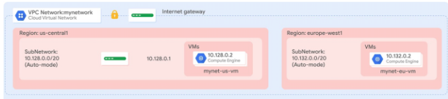

# Overview

In this lab, you create a Terraform configuration with a module to automate the deployment of Google Cloud infrastructure. Specifically, you deploy one auto mode network with a firewall rule and two VM instances, as shown in this diagram:




```
# Create the mynetwork network
resource "google_compute_network" "mynetwork" {
name = "mynetwork"
# RESOURCE properties go here
auto_create_subnetworks = "true"
}

# Add a firewall rule to allow HTTP, SSH, RDP and ICMP traffic on mynetwork
resource "google_compute_firewall" "mynetwork-allow-http-ssh-rdp-icmp" {
name = "mynetwork-allow-http-ssh-rdp-icmp"
# RESOURCE properties go here
network = google_compute_network.mynetwork.self_link
allow {
    protocol = "tcp"
    ports    = ["22", "80", "3389"]
    }
allow {
    protocol = "icmp"
    }
source_ranges = ["0.0.0.0/0"]
}

resource "google_compute_instance" "vm_instance" {
  name         = "${var.instance_name}"
  zone         = "${var.instance_zone}"
  machine_type = "${var.instance_type}"
  boot_disk {
    initialize_params {
      image = "debian-cloud/debian-11"
      }
  }
  network_interface {
    network = "${var.instance_network}"
    access_config {
      # Allocate a one-to-one NAT IP to the instance
    }
  }
}

# Create the mynet-us-vm instance
module "mynet-us-vm" {
  source           = "."
  instance_name    = "mynet-us-vm"
  instance_zone    = "Zone"
  instance_network = google_compute_network.mynetwork.self_link
}

# Create the mynet-eu-vm" instance
module "mynet-eu-vm" {
  source           = "."
  instance_name    = "mynet-eu-vm"
  instance_zone    = "Zone 2"
  instance_network = google_compute_network.mynetwork.self_link
}
```