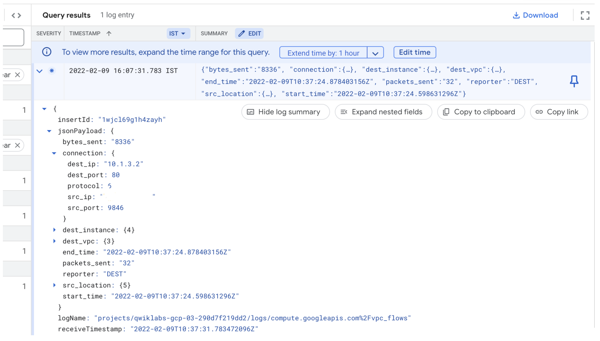
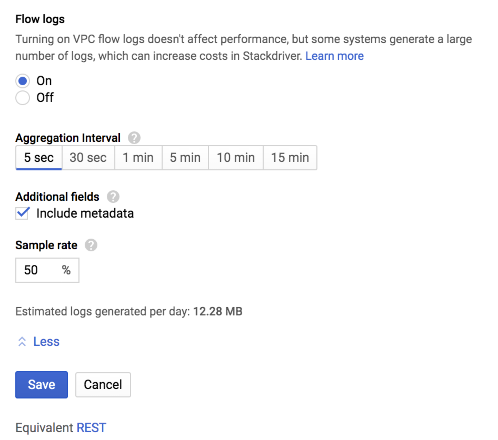

# Overview

In this lab, you will learn how to configure a network to record traffic to and from an Apache web server using VPC Flow Logs. You will then export the logs to BigQuery for analysis.

There are multiple use cases for VPC Flow Logs. For example, you might use VPC Flow Logs to determine where your applications are being accessed from to optimize network traffic expense, to create HTTP Load Balancers to balance traffic globally, or to denylist unwanted IP addresses with Cloud Armor.

# Objectives

- Configure a custom network with VPC Flow Logs.
- Create an Apache web server.
- Verify that network traffic is logged.
- Export the network traffic to BigQuery to further analyze the logs.
- Setup VPC flow log aggregation.

## Configure a custom network with VPC Flow Logs

- In the Console, navigate to Navigation menu (Navigation menu icon) > VPC network > VPC networks. 
- Click Create VPC Network named `vpc-net`
- For Subnet creation mode, click Custom.
```
Name	    vpc-subnet
Region	    REGION
IPv4 range	10.1.3.0/24
Flow Logs	On
```

## Create the firewall rule

In order to serve HTTP and SSH traffic on the network, you need to create a firewall rule.

- In the left menu, click Firewall.
- Click Create Firewall Rule.
- Set the following values, leave all others at their defaults:
```
Name	              allow-http-ssh
Network	              vpc-net
Targets	              Specified target tags
Target tags	          http-server
Source filter	      IPv4 ranges
Source IPv4 ranges	  0.0.0.0/0
Protocols and ports	  tcp: 80, 22
```
*Note: Make sure to include the /0 in the Source IPv4 ranges to specify all networks (i.e. request can originate from any ips).*

## Create an Apache web server

- In the Console, navigate to Navigation menu (Navigation menu icon) > Compute Engine > VM instances.
- Click CREATE INSTANCE.
- Set the following values, leave all others at their defaults:
```
Name	        web-server
Region	        REGION
Zone        	ZONE
Machine type	e2-micro (2 vCPU, 1GB memory)
Firewall	    Allow HTTP traffic
```
- Click Networking, disks, security, management, sole-tenancy.
- Click Networking.
- For Network interfaces, click on default to edit.
- Set the following values, leave all others at their defaults:
```
Network	    vpc-net
Subnetwork	vpc-subnet
```

Configure the VM instance that you created as an Apache webserver and overwrite the default web page.

In the web-server SSH terminal

```
sudo apt-get update && sudo apt-get install apache2 -y
```

Overrite default web page

```
echo '<!doctype html><html><body><h1>Hello World!</h1></body></html>' | sudo tee /var/www/html/index.html
```

## Verify that network traffic is logged

To view web-server, click the External IP to access the server.

```
Note: The Hello World! welcome page, which you configured, opens. Alternatively, you can access the server in a new tab by navigating to http://Enter the external IP Address.
```

### Find your IP address

- Click whatismyip.host to find your IP v4 address.
- Copy your IP address. It will be referred to as YOUR_IP_ADDRESS.

### Access the VPC Flow Logs

- In the Console, navigate to Navigation menu > Logging > Logs Explorer.
- In the Log fields panel, under Resource type, click Subnetwork. In the Query results pane, entries from the subnetwork logs appear.
- In the Log fields panel, under Log name, click compute.googleapis.com/vpc_flows.
- Enter "YOUR_IP_ADDRESS" in the Query search box at the top. Then Click Run Query.
- Click on one of the log entries to expand it.
- Within the entry, click the arrows to expand the jsonPayload and then the connection. You may have to click Expand all to see the connection.

```
Note: The connection contains the destination IP address/port number, the protocol, and the source IP address/port number. Depending on the direction of the traffic, the destination is either your web-server or the machine you are working on and vice-versa for the source.

The protocol should be 6, which is the IANA protocol for TCP traffic. One of the port numbers will be 80, representing HTTP port on the web-server and the other port number should be a number greater than 1024, representing HTTP port on your machine.
```

### Add VPC flow log aggregation

You will now explore a new release of VPC flow log volume reduction. Not every packet is captured into its own log record. However, even with sampling, log record captures can be quite large.

You can balance your traffic visibility and storage cost needs by adjusting specific aspects of logs collection, which you will explore in this section.

- In the Console, navigate to Navigation menu (Navigation menu icon) > VPC network > VPC networks.
- Click vpc-net, and then click Edit.
- In the Subnets tab, click vpc-subnet
- Click Edit > Configure logs to expose the following fields:

The purpose of each field is explained below:

Aggregation time interval: Sampled packets for a time interval are aggregated into a single log entry. This time interval can be 5 sec (default), 30 sec, 1 min, 5 min, 10 min, or 15 min.

Metadata annotations: By default, flow log entries are annotated with metadata information, such as the names of the source and destination VMs or the geographic region of external sources and destinations. This metadata annotation can be turned off to save storage space.

Log entry sampling: Before being written to the database, the number of logs can be sampled to reduce their number. By default, the log entry volume is scaled by 0.50 (50%), which means that half of entries are kept. You can set this from 1.0 (100%, all log entries are kept) to 0.0 (0%, no logs are kept).

