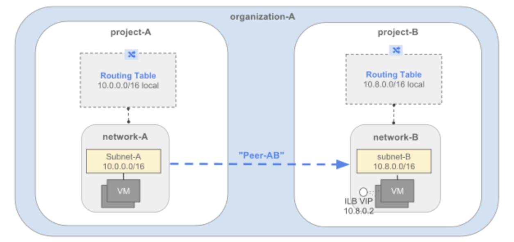
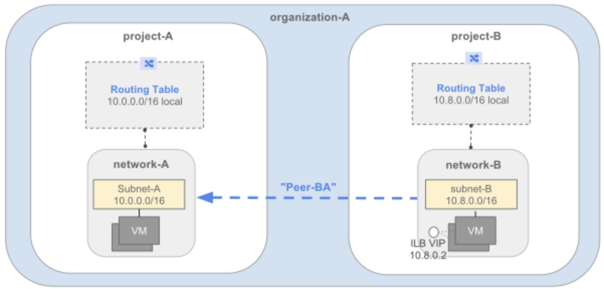
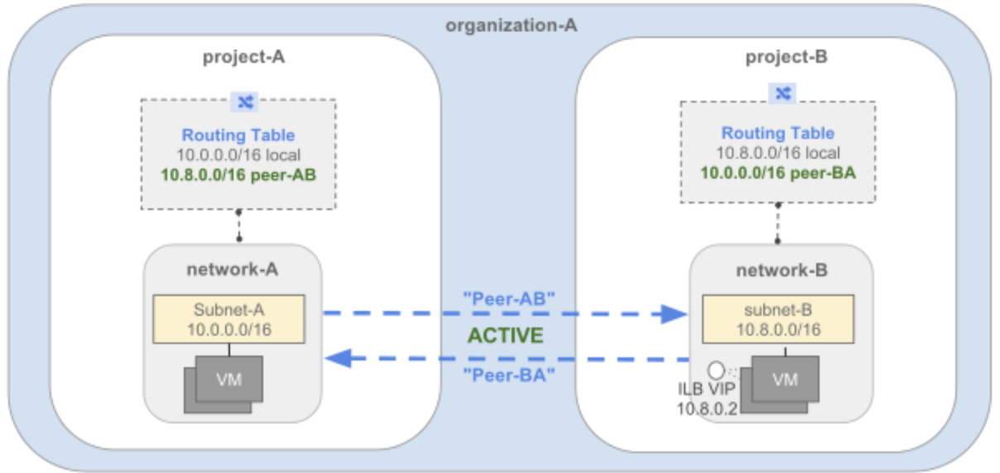

# Overview

Google Cloud Virtual Private Cloud (VPC) Network Peering allows private connectivity across two VPC networks regardless of whether or not they belong to the same project or the same organization.

VPC Network Peering allows you to build SaaS (Software-as-a-Service) ecosystems in Google Cloud, making services available privately across different VPC networks within and across organizations, allowing workloads to communicate in private space.

VPC Network Peering is useful for:

- Organizations with several network administrative domains.
- Organizations that want to peer with other organizations.

If you have multiple network administrative domains within your organization, VPC Network Peering allows you to make services available across VPC networks in private space. If you offer services to other organizations, VPC Network Peering allows you to make those services available in private space to those organizations.

The ability to offer services across organizations is useful if you want to offer services to other enterprises, and it is useful within your own enterprise if you have several distinct organization nodes due to your own structure or as a result of mergers or acquisitions.

VPC Network Peering gives you several advantages over using external IP addresses or VPNs to connect networks, including:

- Network Latency: Private networking offers lower latency than public IP networking.
- Network Security: Service owners do not need to have their services exposed to the public Internet and deal with its associated risks.
- Network Cost: Networks that are peered can use internal IPs to communicate and save Google Cloud egress bandwidth costs. Regular network pricing still applies to all traffic.

# Objectives

- Create a custom network in two projects
- Set up a VPC network peering session

# Create a custom network in both projects

Within the same organization node, a network could be hosting services that need to be accessible from other VPC networks in the same or different projects.

Alternatively, one organization may want to access services a third-party service is offering.

Project names are unique across all of Google Cloud, so you do not need to specify the organization when setting up peering. Google Cloud knows the organization based on the project name.

In this lab, you have been provisioned 2 projects, the first project is project-A and second is project-B.


# VPC in project-A

In the Cloud Shell for project-A, set the project ID for the project-A, create VPC, subnets, vms, and firewalls rules :
```
gcloud config set project Project 1
```

Create VPC
```
gcloud compute networks create network-a --subnet-mode custom
```

Create subnets
```
gcloud compute networks subnets create network-a-subnet --network network-a \
    --range 10.0.0.0/16 --region 
```

Create a VM instance:
```
gcloud compute instances create vm-a --zone  --network network-a --subnet network-a-subnet --machine-type e2-small
```

Run the following to enable SSH and icmp, because you'll need a secure shell to communicate with VMs during connectivity testing:
```
gcloud compute firewall-rules create network-a-fw --network network-a --allow tcp:22,icmp
```


# VPC in project-B

In the Cloud Shell for project-B, set the project ID for the project-B, create VPC, subnets, vms, and firewalls rules :
```
gcloud config set project Project 2
```

Create VPC
```
gcloud compute networks create network-b --subnet-mode custom
```

Create subnets
```
gcloud compute networks subnets create network-b-subnet --network network-b \
    --range 10.8.0.0/16 --region
```

Create a VM instance:
```
gcloud compute instances create vm-b --zone  --network network-b --subnet network-b-subnet --machine-type e2-small
```

Run the following to enable SSH and icmp, because you'll need a secure shell to communicate with VMs during connectivity testing:
```
gcloud compute firewall-rules create network-b-fw --network network-b --allow tcp:22,icmp
```

# Set up a VPC network peering session

Consider an organization which needs VPC Network Peering to be established between network-A in project-A, and network-B in project-B. In order for VPC Network Peering to be established successfully, administrators of network-A and network-B must separately configure the peering association.

# Peer network-A with network-B:



# Setting in project-A

Go to the VPC Network Peering in the Cloud Console by navigating to the Networking section and clicking VPC Network > VPC network peering in the left menu. Once you're there:

- Click Create connection.
- Click Continue.
- Type "peer-ab" as the Name for this side of the connection.
- Under Your VPC network, select the network you want to peer (network-a).
- Set the Peered VPC network radio buttons to In another project.
- Paste in the Project ID of the second project.
- Type in the VPC network name of the other network in the second project (network-b).
- Click Create.

# Peer network-b with network-a




# Setting in project-B

- Click Create connection.
- Click Continue.
- Type "peer-ba" as the Name for this side of the connection.
- Under Your VPC network, select the network you want to peer (network-b).
- Set the Peering VPC network radio buttons to In another project, unless you wish to peer within the same project.
- Specify the Project ID of the first project.
- Specify VPC network name of the other network (network-a).
- Click Create.

# Final VPC Network Peering Architecture



To list all the routes in the VPC

```
gcloud compute routes list --project 
```

