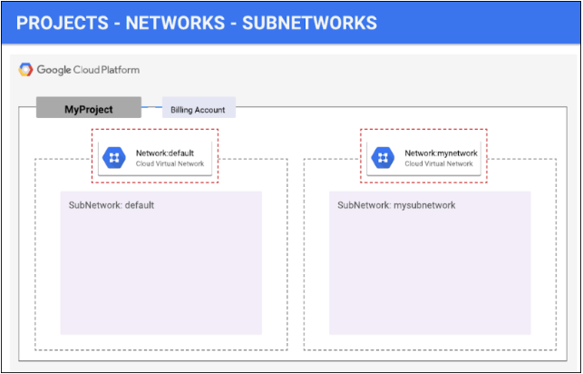
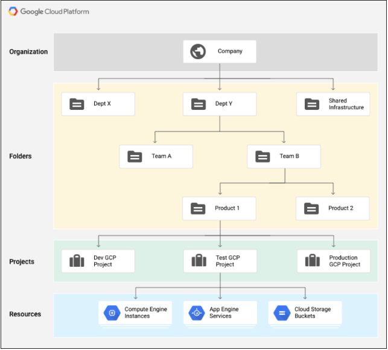

# Overview

A Virtual Private Cloud (VPC) network is a global resource which consists of a list of regional virtual subnetworks 
(subnets) in data centers, all connected by a global wide area network (WAN). VPC networks are logically isolated from 
each other in Google Cloud.

VPC provides networking functionality to Compute Engine virtual machine (VM) instances, Kubernetes Engine containers, 
and App Engine Flex. Each Google Cloud project by default has a default network configuration which provides each region 
with an auto subnet network.

In this lab you use gcloud to create two custom VPC networks with subnets, firewall rules, and VM instances, then test 
the networks' ability to allow traffic from the public internet.

## Understanding Regions and Zones

Certain Compute Engine resources live in regions or zones. A region is a specific geographical location where you can run 
your resources. Each region has one or more zones. For example, the us-central1 region denotes a region in the Central 
United States that has zones us-central1-a, us-central1-b, us-central1-c, and us-central1-f.

Regions	Zones
```
Western US	    us-west1-a, us-west1-b
Central US	    us-central1-a, us-central1-b, us-central1-d, us-central1-f
Eastern US	    us-east1-b, us-east1-c, us-east1-d
Western Europe	europe-west1-b, europe-west1-c, europe-west1-d
Eastern Asia	  asia-east1-a, asia-east1-b, asia-east1-c
```

Resources that live in a zone are referred to as zonal resources. Virtual machine Instances and persistent disks live in a zone. 
To attach a persistent disk to a virtual machine instance, both resources must be in the same zone. Similarly, if you want to 
assign a static IP address to an instance, the instance must be in the same region as the static IP.


## Google Cloud Network Concepts

Google Cloud Platform supports Projects, Networks, and Subnetworks to provide flexible, logical isolation of unrelated resources.



### Projects
Projects are the outermost container and are used to group resources that share the same trust boundary. Many developers map 
Projects to teams since each Project has its own access policy (IAM) and member list. Projects also serve as a collector of 
billing and quota details reflecting resource consumption. Projects contain Networks which contain Subnetworks, Firewall rules, 
and Routes (see below architecture diagrams for illustration).




### Networks
Networks directly connect your resources to each other and to the outside world. Networks, using Firewalls, also house the access 
policies for incoming and outgoing connections. Networks can be Global (offering horizontal scalability across multiple Regions) 
or Regional (offering low-latency within a single Region).

### Subnetworks
Subnetworks allow you to group related resources (Compute Engine instances) into RFC1918 private address spaces. Subnetworks can 
only be Regional. A subnetwork can be in auto mode or custom mode.

- An auto mode network has one subnet per region, each with a predetermined IP range and gateway. These subnets are created automatically 
  when you create the auto mode network, and each subnet has the same name as the overall network.
- A custom mode network has no subnets at creation. In order to create an instance in a custom mode network, you must first create a subnetwork 
  in that region and specify its IP range. A custom mode network can have zero, one, or many subnets per region.

### Firewalls
Each network has a default firewall that blocks all inbound traffic to instances. To allow traffic to come into an instance, you must create 
"allow" rules for the firewall. Additionally, the default firewall allows traffic from instances unless you configure it to block outbound 
connections using an "egress" firewall configuration. Therefore, by default you can create "allow" rules for traffic you wish to pass ingress, 
and "deny" rules for traffic you wish to restrict egress. You may also create a default-deny policy for egress and prohibit external 
connections entirely.

### Network route
All networks have routes created automatically to the Internet (default route) and to the IP ranges in the network. The route names are 
automatically generated and will look different for each project.

- To review default routes, click Navigation menu > VPC network > Routes > Select Network and Region to view Routes.

Google Cloud Networking uses Routes to direct packets between subnetworks and to the Internet. Whenever a subnetwork is created 
(or pre-created) in your Network, routes are automatically created in each region to allow packets to route between subnetworks. 
These cannot be modified.

Additional Routes can be created to send traffic to an instance, a VPN gateway, or default internet gateway. These Routes can be 
modified to tailor the desired network architecture. Routes and Firewalls work together to ensure your traffic gets where it needs 
to go.

## Explore the default network

Each Google Cloud project has a default network with subnets, routes, and firewall rules.

### Subnets for default network
The default network has a subnet in each Google Cloud region.

- In the Cloud Console, on the Navigation menu (Navigation menu icon), click VPC network > VPC networks.
- Notice the default network with its subnets.
Each subnet is associated with a Google Cloud region and a private RFC 1918 CIDR block for its internal IP addresses range 
and a gateway.

### Routes for default network

Routes tell VM instances and the VPC network how to send traffic from an instance to a destination, either inside the network or 
outside Google Cloud. Each VPC network comes with some default routes to route traffic among its subnets and send traffic from eligible 
instances to the internet.

- In the left pane, click Routes.
- Notice that there is a route for each subnet and one for the `Default internet gateway (0.0.0.0/0)`.

These routes are managed for you, but you can create custom static routes to direct some packets to specific destinations. For example, 
you can create a route that sends all outbound traffic to an instance configured as a **NAT gateway**.

### Firewall rules for default network

Each VPC network implements a distributed virtual firewall that you can configure. Firewall rules allow you to control which packets 
are allowed to travel to which destinations. Every VPC network has two implied firewall rules that block all incoming connections and 
allow all outgoing connections.

Notice that there are 4 Ingress firewall rules for the default network:

- default-allow-icmp
- default-allow-rdp
- default-allow-ssh
- default-allow-internal

These firewall rules allow ICMP, RDP, and SSH ingress traffic from anywhere (0.0.0.0/0) and all TCP, UDP, and ICMP traffic within the network


## Create a VPC Network (labnet)

```
(qwiklabs-gcp-00-32a20e7f9a7a)$ gcloud compute networks create labnet --subnet-mode=custom

Created [https://www.googleapis.com/compute/v1/projects/qwiklabs-gcp-00-32a20e7f9a7a/global/networks/labnet].
NAME: labnet
SUBNET_MODE: CUSTOM
BGP_ROUTING_MODE: REGIONAL
IPV4_RANGE: 
GATEWAY_IPV4: 

Instances on this network will not be reachable until firewall rules
are created. As an example, you can allow all internal traffic between
instances as well as SSH, RDP, and ICMP by running:

$ gcloud compute firewall-rules create <FIREWALL_NAME> --network labnet --allow tcp,udp,icmp --source-ranges <IP_RANGE>
$ gcloud compute firewall-rules create <FIREWALL_NAME> --network labnet --allow tcp:22,tcp:3389,icmp
```

With this command you're doing the following:

gcloud invokes the Cloud SDK gcloud command line tool
compute is a one of the groups available in gcloud, part of a nested hierarchy of command groups
networks is a subgroup of compute with it's own specialized commands
create is the action to be executed on this group
labnet is the name of the network you're creating
--subnet-mode=custom you're passing the subnet mode flag and the type of subnet you're creating, "custom".


### Create a Subnetwork

When you create a subnetwork, its name must be unique in that project for that region, even across networks. 
The same name can appear twice in a project as long as each one is in a different region.

Each subnet must have a primary range, which must be unique within the same region in a project.

Now create sub-network labnet-sub:

```
(qwiklabs-gcp-00-32a20e7f9a7a)$ gcloud compute networks subnets create labnet-sub \
   --network labnet \
   --region "us-east4" \
   --range 10.0.0.0/28
Created [https://www.googleapis.com/compute/v1/projects/qwiklabs-gcp-00-32a20e7f9a7a/regions/us-east4/subnetworks/labnet-sub].
NAME: labnet-sub
REGION: us-east4
NETWORK: labnet
RANGE: 10.0.0.0/28
STACK_TYPE: IPV4_ONLY
IPV6_ACCESS_TYPE: 
INTERNAL_IPV6_PREFIX: 
EXTERNAL_IPV6_PREFIX:
```

### Viewing networks

```
(qwiklabs-gcp-00-32a20e7f9a7a)$ gcloud compute networks list
NAME: default
SUBNET_MODE: AUTO
BGP_ROUTING_MODE: REGIONAL
IPV4_RANGE: 
GATEWAY_IPV4: 

NAME: labnet
SUBNET_MODE: CUSTOM
BGP_ROUTING_MODE: REGIONAL
IPV4_RANGE: 
GATEWAY_IPV4: 
```

### Describing a network

Use describe to view network details, such as its peering connections and subnets.

```
(qwiklabs-gcp-00-32a20e7f9a7a)$ gcloud compute networks describe labnet
autoCreateSubnetworks: false
creationTimestamp: '2024-03-17T20:26:10.677-07:00'
id: '2911377609467759293'
kind: compute#network
name: labnet
networkFirewallPolicyEnforcementOrder: AFTER_CLASSIC_FIREWALL
routingConfig:
  routingMode: REGIONAL
selfLink: https://www.googleapis.com/compute/v1/projects/qwiklabs-gcp-00-32a20e7f9a7a/global/networks/labnet
selfLinkWithId: https://www.googleapis.com/compute/v1/projects/qwiklabs-gcp-00-32a20e7f9a7a/global/networks/2911377609467759293
subnetworks:
- https://www.googleapis.com/compute/v1/projects/qwiklabs-gcp-00-32a20e7f9a7a/regions/us-east4/subnetworks/labnet-sub
x_gcloud_bgp_routing_mode: REGIONAL
x_gcloud_subnet_mode: CUSTOM
```

### List subnets

You can list all subnets in all networks in your project, or you can show only the subnets for a particular 
network or region

Use this command to list all subnets in all VPC networks, in all regions:

```
(qwiklabs-gcp-00-32a20e7f9a7a)$ gcloud compute networks subnets list
```

Use this command to list subnets by name

```
(qwiklabs-gcp-00-32a20e7f9a7a)$ gcloud compute networks subnets list --filter="name=( 'labnet-sub' )"
NAME: labnet-sub
REGION: us-east4
NETWORK: labnet
RANGE: 10.0.0.0/28
STACK_TYPE: IPV4_ONLY
IPV6_ACCESS_TYPE: 
INTERNAL_IPV6_PREFIX: 
EXTERNAL_IPV6_PREFIX: 
```

### Creating firewall rules

Auto networks include default rules, custom networks do not include any firewall rules. Firewall rules are 
defined at the network level, and only apply to the network where they are created.

The name you choose for each firewall rule must be unique to the project. To allow access to VM instances, 
you must apply firewall rules.

With this command you are doing the following:

firewall-rules is a subcategory of compute
create is the action you are taking
labnet-allow-internal is the name of the firewall rule
--network=labnet puts the rule in the labnet network
--action=ALLOW must be used with the --rules flag, and is either "ALLOW" or "DENY"
--rules=icmp,tcp:22 specifies the icmp and tcp protocols and the ports that the rule applies to
--source-ranges=0.0.0.0/0 specifies the ranges of source IP addresses in CIDR format.

```
(qwiklabs-gcp-00-32a20e7f9a7a)$ gcloud compute firewall-rules create labnet-allow-internal \
        --network=labnet \
        --action=ALLOW \
        --rules=icmp,tcp:22 \
        --source-ranges=0.0.0.0/0
Creating firewall...working..Created [https://www.googleapis.com/compute/v1/projects/qwiklabs-gcp-00-32a20e7f9a7a/global/firewalls/labnet-allow-internal].
Creating firewall...done.                                                                                                                      
NAME: labnet-allow-internal
NETWORK: labnet
DIRECTION: INGRESS
PRIORITY: 1000
ALLOW: icmp,tcp:22
DENY: 
DISABLED: False
```

### Viewing firewall rules details

Inspect the firewall rules to see its name, applicable network, and components, including whether the rule is enabled or disabled:

```
(qwiklabs-gcp-00-32a20e7f9a7a)$ gcloud compute firewall-rules describe labnet-allow-internal
allowed:
- IPProtocol: icmp
- IPProtocol: tcp
  ports:
  - '22'
creationTimestamp: '2024-03-17T20:41:10.417-07:00'
description: ''
direction: INGRESS
disabled: false
id: '5443165825783171385'
kind: compute#firewall
logConfig:
  enable: false
name: labnet-allow-internal
network: https://www.googleapis.com/compute/v1/projects/qwiklabs-gcp-00-32a20e7f9a7a/global/networks/labnet
priority: 1000
selfLink: https://www.googleapis.com/compute/v1/projects/qwiklabs-gcp-00-32a20e7f9a7a/global/firewalls/labnet-allow-internal
sourceRanges:
- 0.0.0.0/0
```

## Create another VPN network (privatenet)

Now you'll create a another network, add firewall rules to it, then add VMs to both networks to test the ability 
to communicate with the networks.

### create the privatenet network

```
(qwiklabs-gcp-00-32a20e7f9a7a)$ gcloud compute networks create privatenet --subnet-mode=custom
Created [https://www.googleapis.com/compute/v1/projects/qwiklabs-gcp-00-32a20e7f9a7a/global/networks/privatenet].
NAME: privatenet
SUBNET_MODE: CUSTOM
BGP_ROUTING_MODE: REGIONAL
IPV4_RANGE: 
GATEWAY_IPV4: 

Instances on this network will not be reachable until firewall rules
are created. As an example, you can allow all internal traffic between
instances as well as SSH, RDP, and ICMP by running:

$ gcloud compute firewall-rules create <FIREWALL_NAME> --network privatenet --allow tcp,udp,icmp --source-ranges <IP_RANGE>
$ gcloud compute firewall-rules create <FIREWALL_NAME> --network privatenet --allow tcp:22,tcp:3389,icmp
```

### Create the private-sub subnet

```
(qwiklabs-gcp-00-32a20e7f9a7a)$ gcloud compute networks subnets create private-sub \
    --network=privatenet \
    --region="us-east4" \
    --range 10.1.0.0/28
Created [https://www.googleapis.com/compute/v1/projects/qwiklabs-gcp-00-32a20e7f9a7a/regions/us-east4/subnetworks/private-sub].
NAME: private-sub
REGION: us-east4
NETWORK: privatenet
RANGE: 10.1.0.0/28
STACK_TYPE: IPV4_ONLY
IPV6_ACCESS_TYPE: 
INTERNAL_IPV6_PREFIX: 
EXTERNAL_IPV6_PREFIX: 
```

### Create the firewall rules for privatenet

```
(qwiklabs-gcp-00-32a20e7f9a7a)$ gcloud compute firewall-rules create privatenet-deny \
    --network=privatenet \
    --action=DENY \
    --rules=icmp,tcp:22 \
    --source-ranges=0.0.0.0/0
Creating firewall...working..Created [https://www.googleapis.com/compute/v1/projects/qwiklabs-gcp-00-32a20e7f9a7a/global/firewalls/privatenet-deny].
Creating firewall...done.                                                                                                                      
NAME: privatenet-deny
NETWORK: privatenet
DIRECTION: INGRESS
PRIORITY: 1000
ALLOW: 
DENY: icmp,tcp:22
DISABLED: False
```

## Create VM instances

Create two VM instances in the subnets:

- `pnet-vm` in `private-sub`
- `lnet-vm` in `labnet-sub`

Create the pnet-vm instance in the `private-sub` subnet

```
(qwiklabs-gcp-00-32a20e7f9a7a)$ gcloud compute instances create pnet-vm \             
--zone="us-east4-a" \
--machine-type=n1-standard-1 \
--subnet=private-sub
Created [https://www.googleapis.com/compute/v1/projects/qwiklabs-gcp-00-32a20e7f9a7a/zones/us-east4-a/instances/pnet-vm].
NAME: pnet-vm
ZONE: us-east4-a
MACHINE_TYPE: n1-standard-1
PREEMPTIBLE: 
INTERNAL_IP: 10.1.0.2
EXTERNAL_IP: 35.236.245.109
STATUS: RUNNING
```

Create the lnet-vm instance in the `labnet-sub` subnet

```
(qwiklabs-gcp-00-32a20e7f9a7a)$ gcloud compute instances create lnet-vm --zone="us-east4-a" --machine-type=
n1-standard-1 --subnet=labnet-sub
Created [https://www.googleapis.com/compute/v1/projects/qwiklabs-gcp-00-32a20e7f9a7a/zones/us-east4-a/instances/lnet-vm].
NAME: lnet-vm
ZONE: us-east4-a
MACHINE_TYPE: n1-standard-1
PREEMPTIBLE: 
INTERNAL_IP: 10.0.0.2
EXTERNAL_IP: 34.48.58.123
STATUS: RUNNING
```

list all the VM instances (sorted by zone)

```
(qwiklabs-gcp-00-32a20e7f9a7a)$ gcloud compute instances list --sort-by=ZONE
NAME: lnet-vm
ZONE: us-east4-a
MACHINE_TYPE: n1-standard-1
PREEMPTIBLE: 
INTERNAL_IP: 10.0.0.2
EXTERNAL_IP: 34.48.58.123
STATUS: RUNNING

NAME: pnet-vm
ZONE: us-east4-a
MACHINE_TYPE: n1-standard-1
PREEMPTIBLE: 
INTERNAL_IP: 10.1.0.2
EXTERNAL_IP: 35.236.245.109
STATUS: RUNNING
```

## Explore the connectivity

When you created the networks, you applied firewall rules to each - so one network allows `INGRESS` traffic, 
and the other denies `INGRESS` traffic.

For this experiment, you should be able to communicate with the first network, but be unable to communicate 
with the second one.

Ping the external IP addresses

1. Ping lnet-vm's external IP: This should work - lnet-vm's network has a firewall rule that allows traffic.
```
(qwiklabs-gcp-00-32a20e7f9a7a)$ ping -c 3 34.48.58.123
PING 34.48.58.123 (34.48.58.123) 56(84) bytes of data.
64 bytes from 34.48.58.123: icmp_seq=1 ttl=55 time=12.9 ms
64 bytes from 34.48.58.123: icmp_seq=2 ttl=55 time=11.8 ms
64 bytes from 34.48.58.123: icmp_seq=3 ttl=55 time=11.8 ms
```

2. Ping pnet-vm's external IP address: This should not work - nothing should be happening. pnet-vm's network has a 
firewall rule that denies traffic.

```
(qwiklabs-gcp-00-32a20e7f9a7a)$ ping -c 3 35.236.245.109
PING 35.236.245.109 (35.236.245.109) 56(84) bytes of data.

--- 35.236.245.109 ping statistics ---
3 packets transmitted, 0 received, 100% packet loss, time 2047ms
```

## Internal DNS for VMs

Each instance has a metadata server that also acts as a DNS resolver for that instance. DNS lookups are performed 
for instance names. The metadata server itself stores all DNS information for the local network and queries Google's 
public DNS servers for any addresses outside of the local network.

An internal fully qualified domain name (FQDN) for an instance looks like this: `hostName.[ZONE].c.[PROJECT_ID].internal`.
You can always connect from one instance to another using this FQDN. If you want to connect to an instance using, for example, 
just hostName, you need information from the internal DNS resolver that is provided as part of Compute Engine.

## TraceRoute

Traceroute is a tool to trace the path between two hosts. A traceroute can be a helpful first step to uncovering many 
different types of network problems. Support or network engineers often ask for a traceroute when diagnosing network 
issues.

Traceroute shows all Layer 3 (routing layer) hops between the hosts. This is achieved by sending packets to the remote destination 
with increasing TTL (Time To Live) value (starting at 1). The TTL field is a field in the IP packet which gets decreased by one at 
every router. Once the TTL hits zero, the packet gets discarded and a "TTL exceeded" ICMP message is returned to the sender. This 
approach is used to avoid routing loops; packets cannot loop continuously because the TTL field will eventually decrement to 0. By 
default the OS sets the TTL value to a high value (64, 128, 255 or similar), so this should only ever be reached in abnormal situations.
So traceroute sends packets first with TTL value of 1, then TTL value of 2, etc., causing these packets to expire at the first/second/etc. 
router in the path. It then takes the source IP/host of the ICMP TTL exceeded message returned to show the name/IP of the intermediate hop. 
Once the TTL is high enough, the packet reaches the destination, and the destination responds.

The type of packet sent varies by implementation. Under Linux, UDP packets are sent to a high, unused port. So the final destination responds 
with an ICMP Port Unreachable. Windows and the mtr tool by default use ICMP echo requests (like ping), so the final destination answers with 
an ICMP echo reply.

## iPerf

iPerf is a widely used network testing tool that can measure the bandwidth and the performance of network links. In Google Cloud Platform (GCP) 
networking, iPerf can be particularly useful for several scenarios:

- Performance Benchmarking: You can use iPerf to test the network performance between different regions or zones within GCP. This can help in 
  selecting the most appropriate regions or zones for your applications based on network speed and latency.

- Troubleshooting Network Issues: iPerf can help identify network bottlenecks or connectivity issues within your GCP environment. By running 
  tests between virtual machines (VMs) in different parts of your network, you can pinpoint areas of poor performance and potential disruptions.

- Bandwidth Measurement: iPerf is excellent for measuring the maximum bandwidth achievable between VM instances in GCP. This can be critical for 
  applications that require high throughput, enabling you to verify if the network infrastructure meets the application’s bandwidth requirements.

- Network Optimization: By continuously monitoring network performance using iPerf, you can make informed decisions about network configurations, 
  such as firewall rules, routes, and VM sizes. This ensures that your network is optimized for both performance and cost.

In essence, iPerf is a versatile tool in the GCP toolkit, aiding in the detailed analysis and optimization of network performance to ensure 
applications run efficiently and reliably on Google Cloud's infrastructure.